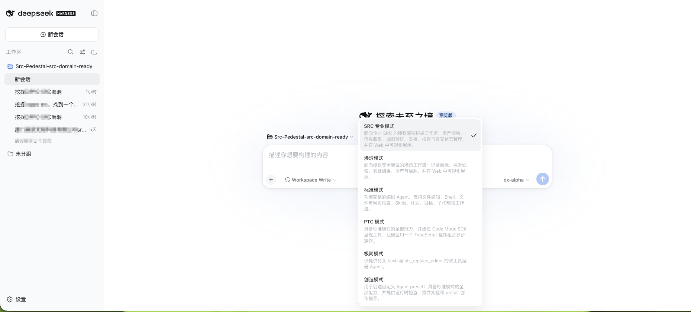
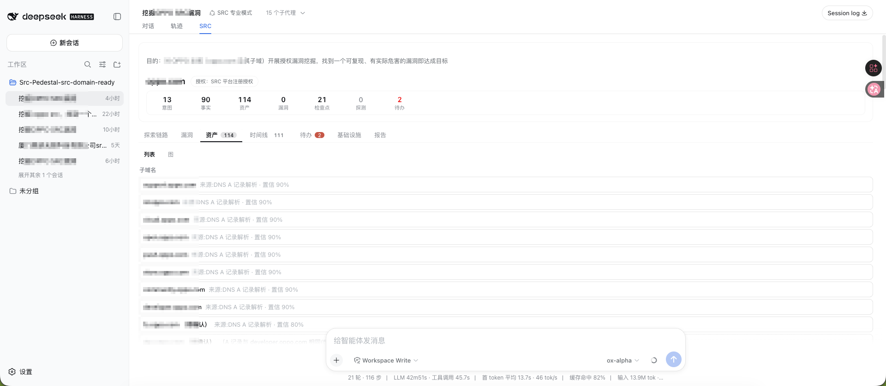
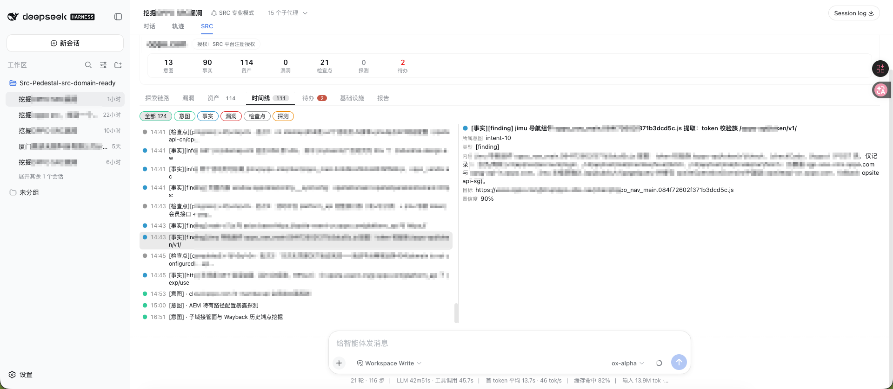
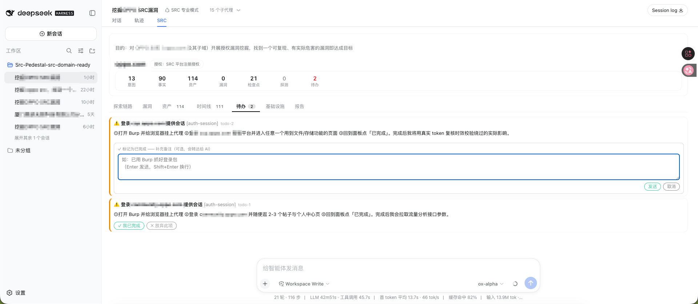
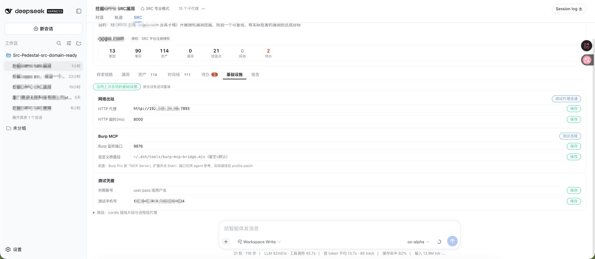

# dsh-src — DSH SRC 漏洞挖掘模式

面向 [DeepSeek Harness](https://github.com/deepseek-ai/deepseek-harness)（dsh）的 SRC 漏洞挖掘模式插件。它把一次授权漏洞挖掘组织成一条**可审计的探索链路**：目标 → 研究方向 → 事实 → 假设 → 验证 → 漏洞报告，全程由 agent 推进、在 Web 面板可视化，最终一键产出结构化 Markdown 报告。

一个自包含 bundle 包（`@howmp/dsh-src`）：宿主工具集、Web 界面、sqlite 存储后端和「SRC 专业模式」agent 预设通过包内 `exports` 一同分发，`dsh plugin add` 一条命令安装。

---

## 功能特性

### 探索链路方法论
- **结构化记录**：`goal → intent → fact → finding` 四层节点 + `spawns / yields / derived_from / proves` 关系边，每次 `src_*` 工具调用都落库并可重放，图与日志永远一致。
- **子代理并发委派**：主 agent 按事实拆分研究方向，fork 子代理并发执行；每个子代理通过 `src_submit` 直写父 intent 并留下 durable checkpoint——父会话崩溃也能恢复现场（`src_recover_child`）。
- **AI 发现漏斗**：被动采集（crt.sh/HackerTarget/Google dorks/robots/sitemap/JS 接口 hint）→ API endpoint 资产化 → 自动生成 coverage/research skeleton → 逐项推进验证，防止「发现了接口但没真正测」。

### Web 面板（七个标签页）
| 标签页 | 内容 |
|---|---|
| 探索链路 | 交互式图视图（可平移缩放），展示 goal→intent→fact→finding 全链 |
| 漏洞 | finding 卡片：severity、危害双视角论证、可复现步骤、POC、原始请求/响应 |
| 资产 | 资产树 + 分组列表，来源/方式/置信度/状态四维溯源 |
| 时间线 | 时间轴 + 详情双栏，observation 可展开看完整请求响应头与体 |
| 待办 | agent 发起的用户待办（如登录态抓包），勾选后自动写回会话 |
| 基础设施 | 代理 / Burp MCP / 测试凭据配置，带连通性测试按钮，新会话可一键沿用 |
| 报告 | 结构化 Markdown 报告，可直接复制提交 SRC 平台 |

### 人机命令（面板直写存储，不打扰 agent）
| 命令 | 作用 |
|---|---|
| `/src-infra <key> <value>` | 保存基础设施设置（`-` 恢复默认） |
| `/src-infra-copy` | 从最近配置过的会话沿用全部基础设施 |
| `/src-proxy-test` | 经代理请求探针，直出连通性结果 |
| `/src-burp-test` | Burp MCP 端到端实测（tools/list + 拉 history） |
| `/src-todo <id> <status> [note]` | 用户待办完成/放弃反馈 |

### 安全纪律（提示词与工具双重约束）
- 只测有授权的目标（SRC 平台注册即视为默认授权）；支持直接输入公司名/品牌名，自动解析为官网主域后开测，仅当无法唯一确定时才会向你确认。
- WAF 三层纪律：识别保护信号即停 → 有界绕过研究（逐变体低并发差分）→ 绝不无界暴力。
- 允许有界爆破（登录弱口令等），禁止 DoS、代理池轮换、captcha 破解、隐蔽大规模扫描。
- finding 必须包含可复现步骤、影响论证、受影响范围、修复建议和至少一条 POC；未复现内容只能作为 fact/hypothesis。

---

## 环境要求

- **Node.js ≥ 24**（使用内置 `node:sqlite`）
- **dsh CLI**（`@deepseek-ai/dsh` ≥ 0.1.0-rc.6）与已初始化的 `web` profile
- 可选：**Burp Suite Pro** + "MCP Server" BApp 扩展（实时流量导入）

## 安装

> 安装本质是把 bundle 包装进 profile 的依赖树：`dsh plugin --profile web add <包>` 内部转发 `pnpm add`，重启 dsh 后补丁层自动生效。

### 方式一：从 GitHub Release 安装（推荐）

```bash
# 资产名以 Releases 页为准（形如 howmp-dsh-src-<版本>.tgz）
dsh plugin --profile web add https://github.com/803S/dsh-src/releases/latest/download/howmp-dsh-src-<版本>.tgz
```

### 方式二：从源码构建安装

```bash
git clone https://github.com/803S/dsh-src.git
cd dsh-src && npm pack
dsh plugin --profile web add file:$PWD/howmp-dsh-src-<版本>.tgz
```

### 启用

重启 dsh 后：

1. 新建会话时选择自动注册的 **「SRC 专业模式」**（预设名 `src-hunter`）；
2. 或设为默认预设（`$DSH_HOME/settings.yaml`）：

```yaml
agent-presets:
  default: src-hunter
```

3. 打开对话输入目标开始挖掘；侧栏出现 **SRC** 视图即可看到探索链路各标签页。

## 可选：接入 Burp MCP

不接 Burp 插件照常工作（HAR/raw 文件导入兜底）。要实时导入浏览流量、把抓包直接喂给 agent：

1. Burp Suite Pro 安装 "MCP Server" 扩展并点 **Start**（默认监听 `127.0.0.1:9876`）；
2. 打开 dsh 面板 → SRC 视图 → **基础设施**页，核对端口后点「测试 Burp MCP 连接」——通了就完事。

接线与自愈桥安装都自动完成，只需跑一次：

```bash
node \
  ~/.dsh/profiles/web/node_modules/@howmp/dsh-src/scripts/caps-sync.mjs
```

> **不需要 PortSwigger 官方的 `mcp-proxy.jar`**：stdio↔SSE 协议转换由包内自带的桥脚本完成，上面这条命令会把它自动装到 `~/.dsh/tools/` 并写好接线——你不需要下载、放置任何 jar；以前按旧教程装过的 jar 可以直接删掉。

没跑过 sync 时 Burp 功能静默不启用，不影响其它功能。

<details>
<summary>细节：自愈桥是什么 / 不想用 caps-sync 怎么手动装</summary>

桥脚本 `tools/burp-mcp-bridge.mjs` 负责 stdio↔SSE 协议转换、断连自动重开会话，替代 PortSwigger 官方 mcp-proxy.jar（其 SSE 断线后 -32603 无法自愈）。扩展 SSE 端点在根路径 `/` 且仅支持 HTTP。

手动装桥（替代 caps-sync，效果相同）：

```bash
mkdir -p ~/.dsh/tools && cp ~/.dsh/profiles/web/node_modules/@howmp/dsh-src/tools/burp-mcp-bridge.mjs ~/.dsh/tools/
```

重启 dsh 生效。
</details>

## 可选：接入外部能力（JS 逆向 / 二进制 / 移动端…）

以 docker compose 式体验接入任意外部 MCP 能力：**只维护一份 `~/.dsh/capabilities.yaml`，跑一次 sync，重启生效**。能力本体统一安装在 `~/.dsh/capabilities/<id>/`，接线由脚本生成，不手改 patch。

**懒人方式（推荐）**：把 [docs/INSTALL-PROMPT.md](docs/INSTALL-PROMPT.md) 整段复制给任意 AI 编码助手并附上项目链接，它会自动判断能否接入 → 写清单 → 跑 sync → 验证。

<details>
<summary><b>手动三步（点开折叠）</b></summary>

```bash
cp capabilities.yaml.example ~/.dsh/capabilities.yaml           # 首次：从示例创建清单
# 编辑清单（npm 型一行即接；git 型声明 build 后自动 clone+构建）
node ~/.dsh/profiles/web/node_modules/@howmp/dsh-src/scripts/caps-sync.mjs   # 同步：安装+生成接线
```

示例条目：

```yaml
capabilities:
  - id: jshook                                  # 工具前缀 mcp__jshook__*
    from: npm:@jshookmcp/jshook@latest          # npm 型：首次启动自动下载
    enabled: true
    env: { MCP_TOOL_PROFILE: search }
    when: 遇到 JS 混淆/加密签名需要运行时 Hook 时   # 给 agent 的路由提示

  - id: ruishu                                  # git 型：自动 clone 到统一目录并构建
    from: git:https://github.com/xuange520/ruishu-mcp
    ref: main
    build: pnpm install && pnpm build
    entry: dist/index.js
    enabled: true
```

</details>

国内网络下 git 型 clone 可在清单顶部加代理占位（仅影响 sync 内部的 git 操作，不改写 shell；不配置默认直连）：

```yaml
settings:
  proxy: http://127.0.0.1:7890   # 可选；npm 型无需配置
```

细节与安全边界见 [docs/CAPABILITIES.md](docs/CAPABILITIES.md)。

## 使用速览

对 agent 以自然语言对话即可开场：

> 挖掘 https://xxx.example.com 的 SRC，授权说明：SRC 平台注册账号 ID 12345

agent 会建 goal → 被动侦察收敛资产面 → 拆分 intent 并发委派子代理 → 逐项验证 → finalize 门禁检查 → 出报告。「基础设施」页建议先配好出站代理（国内目标直连更快，google/github 等域名自动走代理）。

## 数据与隐私

- 所有记录写入本机 `$DSH_HOME/storages/src-sessions.db`（sqlite），不出网。
- 包本身零运行时依赖、零遥测；Google dorks 等被动采集直接从你本机发出。

## 界面预览

### 工作台（对话 + 统计卡条）



### 漏洞视图


### 资产视图



### 时间线



### 用户待办



### 基础设施



### 报告


## 致谢与项目来源

本项目是 [DeepSeek Harness](https://github.com/deepseek-ai/deepseek-harness)（dsh，MIT License）生态的二次开发作品：插件结构、bundle 分发机制、Web 面板与 agent 预设体系均基于 dsh 的公开插件接口构建。感谢 dsh 原作者的设计与开源。

本项目以 [howmp/dsh-pentest](https://github.com/howmp/dsh-pentest) 为参考二次开发而来，探索链路数据模型、工具分层与 Web 面板结构承自该项目。

## 文档

- [开发与迭代历史](docs/DEVELOPMENT.md) —— 架构细节、设计决策、版本迭代日志。

## License

[MIT](LICENSE)
