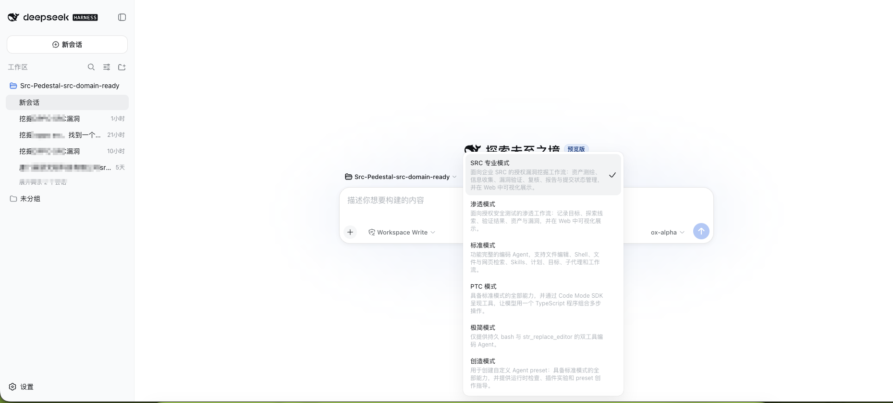
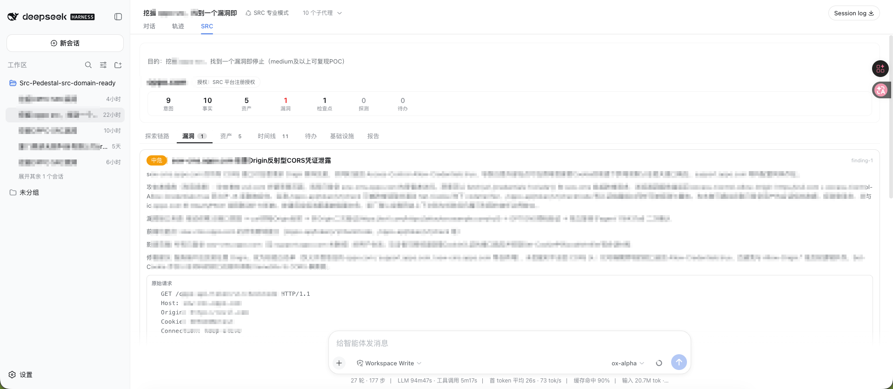
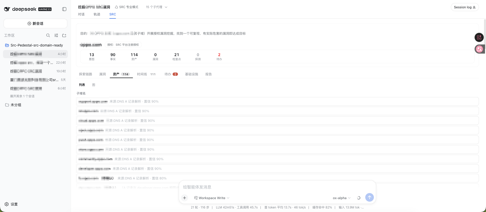
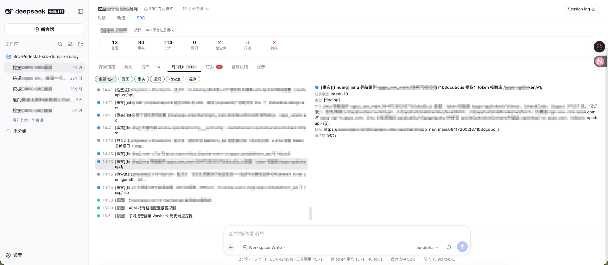
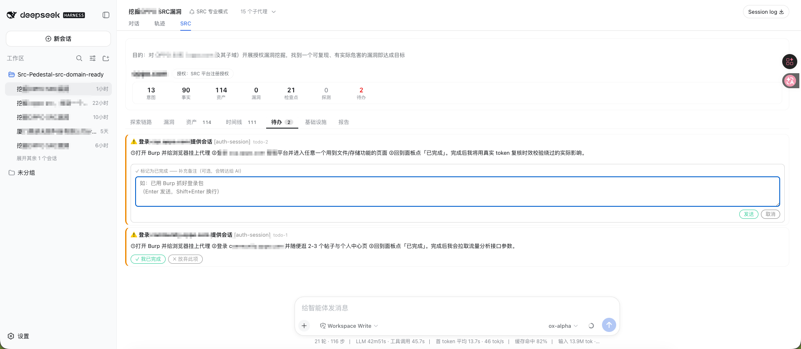
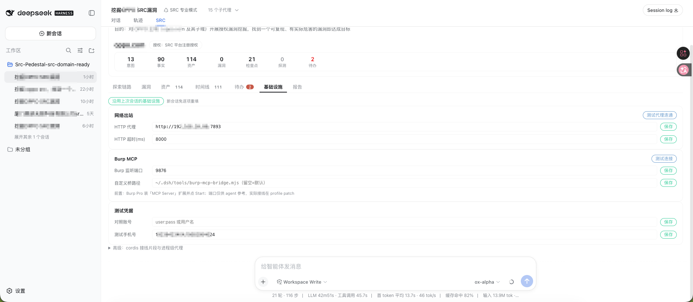
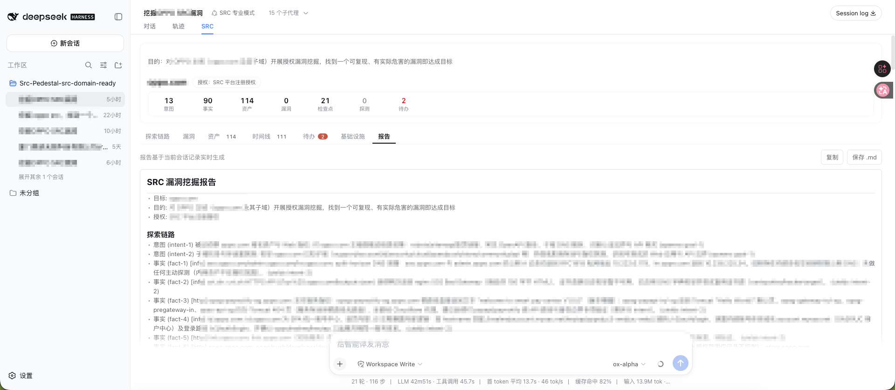

# dsh-src — DSH SRC 漏洞挖掘模式

面向 [DeepSeek Harness](https://github.com/deepseek-ai/deepseek-harness)（dsh）的 SRC 漏洞挖掘模式插件。它把一次授权漏洞挖掘组织成一条**可审计的探索链路**：目标 → 研究方向 → 事实 → 假设 → 验证 → 漏洞报告，全程由 agent 推进、在 Web 面板可视化，最终一键产出结构化 Markdown 报告。

一个自包含 bundle 包（`@lihua_dis/dsh-src`）：宿主工具集、Web 界面、sqlite 存储后端和「SRC 专业模式」agent 预设通过包内 `exports` 一同分发，`dsh plugin add` 一条命令安装。

---

## 最新更新：local.128（2026-10-09）

- 明确两层审批语义：Jev只自动放行低风险误拦请求；人工 `allow` 是高风险/不确定冻结请求的最终放行。
- 审批通过后不再要求模型补 safety plan；严格按原 URL、方法、headers、body、origin和次数执行。发送前失败可恢复同一冻结请求，发送后结果未知禁止盲目重放。
- 高风险增删改、external、Burp等人工批准回归通过；全量585/585。[实施记录](docs/implementation/cve-session-repair-20261009.md)。

## 最新更新：local.127（2026-10-09）

- 审批卡第一屏改为自然语言说明“正在做什么、可能造成什么、批准后只执行一次”；不再把“自动执行材料尚未完整”作为用户主提示。
- 技术判定与执行边界折叠到详情区域；SPIP 忘记密码请求会明确提示可能向指定邮箱发送密码重置邮件。
- 全量回归584/584。[文案修正记录](docs/implementation/cve-session-repair-20261009.md)。

## 最新更新：local.126（2026-10-09）

- 修复CVE会话暴露的审批不可点击、审批后证据回链丢失、SRC全量状态读取卡顿、Jev delegate只记录不派发、公开CVE搜索逐引擎卡60秒等问题。
- 人工审批与自动安全材料分离；冻结请求可明确批准/拒绝，执行结果自动关联response evidence，不要求用户重复提供已存在的数据包。
- SRC UI使用实时projection，不再每条证据重新读取全量权威状态；Jev有效delegate会消费为真实src_recon/src_audit/src_verify子agent派发。
- 完整回归583/583，真实Chrome行动中心验证通过。[CVE会话修复审计与验收](docs/implementation/cve-session-repair-20261009.md)。

## 最新更新：local.125（2026-10-08）

- **不再混淆目标与本机**：页面中的localhost/127地址不获得授权；显式导航提前检查，页面自动请求/重定向仍受实际网关约束，不擅自替换域名或扩展端口。
- **本地拦截直接解释**：浏览器结果附宿主网关拒绝记录，明确未发出，不再把合成403当目标可达。空工具调用单独归类。
- **扫描与研究记录核对**：404/超时不推断多后端，缺失长度不写0，超时从发送开始；状态页显示完整origin和证据/研究记录不一致提示。
- **已交付**：582/582回归、UI与浏览器边界验证通过；Web/headless部署、Web重启、Git提交`d7bf94e`/标签推送、[Release](https://github.com/803S/dsh-src/releases/tag/v0.1.0-local.125)安装包独立下载核验完成。密钥与脱敏专项按用户要求暂缓；没有改动供应商、宿主压缩或通用重试。[实施与验收](docs/implementation/target-context-repair-20261008.md)。

## 历史更新：local.124（2026-10-07）

- 复审并修复自动路径辅助请求漏审、失败误锁独立读取，以及取消、冷启动和并发核对时的审批状态缺陷。
- 自动与人工共用执行检查，补材料/审批/核对共用操作锁；中断批准可核验后继续或拒绝，未知结果展示具体错误并计入待处理事项。
- 新增 11 项真实 SQLite 与本机 HTTP 生命周期回归；完整验证及交付状态见 [审批生命周期复审](docs/implementation/approval-lifecycle-audit-20261007.md)。

## local.123（2026-10-07）

- 修复 Jev 已判定高危，但模型自报读取/计算仍能通过人工批准的问题；批准、补料与冷启动恢复统一核验。
- 前置检查和回读请求在批准前由 Jev 单独核验；已发送后的异常明确报告结果未知，保持禁止重放。
- 未知单笔请求提示用户核对冻结报文，保留低影响单次放行；565 项回归、浏览器及真实 DSH 自主模型验收通过。验证与交付进度见 [审查修复记录](docs/implementation/approval-safety-audit-20261007.md)。

## local.122（2026-10-07）

- 修复人工确认未传递至请求领取阶段，导致批准后仍被同接口旧结果未知锁拦住的问题；保留旧锁及同操作重放保护。
- 已批准但发送前失败的旧单可核验零发送记录后恢复原编号；不是清锁或自动重放。
- 559项回归通过，生产数据隔离副本验证三笔原文实际到达本机；已部署、推送并正式发布，原会话恢复按钮已核验；详见 [修复记录](docs/implementation/approval-resource-repair-20261007.md)。

## local.121（2026-10-07）

- 不再把 Jev“不确定”一律变成不可审批的“缺安全材料”：单笔未知请求可由用户明确确认无写入、外发或资源耗尽后放行一次，原编号保留；已识别高危及方法改写不能走此入口。
- 补充参数格式/类型探测的 Jev 判定规则；卡片展示实际字段类型和可用的确认按钮，无新增依赖、表或服务。
- 555项回归及原会话三张审批按钮验证通过，已部署、推送并正式发布；真实主模型测试的未通过项如实保留，见 [local.121 审批修复记录](docs/implementation/approval-unknown-repair-20261007.md)。

## local.120（2026-10-07）

- 修复非法覆盖状态导致整份会话历史和 SRC 面板无法加载的问题；写入严格校验，旧记录只读兼容，不删除会话或篡改原始结果。
- 已部署并正式发布；541项回归及原会话浏览器加载验证通过，424个会话保留。修复范围及恢复凭据见 [local.120 加载修复记录](docs/implementation/session-load-repair-20261007.md)。

## local.118（2026-10-07）

- 来源 IP 探测交 Jev 判断，不再因 `X-Forwarded-For` 一律挂审；方法/路由改写及编码歧义仍保留硬闸。
- 旧只读待审单经用户显式批准可补齐执行材料；缺材料的写操作不再给出必失败的批准按钮。不会自动重放历史请求。
- 审批展示脱敏 HTTP 报文与简短操作说明，修复扫描遇数字错误码时的二次异常，保留取消和审批异常语义。
- 538项回归通过，Web/headless已部署重启，Git及[正式发行版](https://github.com/803S/dsh-src/releases/tag/v0.1.0-local.118)已发布并独立下载核验。无新增依赖、表或服务；真实DSH验收范围及保留的失败记录见 [local.118 修复记录](docs/implementation/approval-read-repair-20261007.md)。

## local.117（2026-10-07）

- 明确单资产不再重复弹范围审批；未知归属复用整域确认。
- Jev 审核实际影响，删除互相矛盾的重复风险/许可提问；低影响验证自动执行，真实删改或影响不明仍异步挂审。
- 修复同接口待审互锁、重复报文挂单及发送前失败状态；审批卡删除空话模板，默认只呈现目标和真实阻断原因。
- 真实 DSH 会话验证：11 次低影响请求到达、两条破坏性请求零到达，挂审后独立工作继续。33 次真实 Jev 矩阵通过。 531项回归通过，Web/headless已部署并重启，源码与标签已推送，[local.117正式发行版](https://github.com/803S/dsh-src/releases/tag/v0.1.0-local.117)安装包已独立下载核验。完整边界、失败记录与交付状态见[验收记录](docs/implementation/approval-noise-repair-20261007.md)。

## local.116（2026-10-07）

- **基础服务统一视觉**：网络出站、Burp MCP、测试凭据改为与 Jev 设置页一致的卡片、控件和窄屏布局。
- **修复沿用配置不显示**：未建立目标时的权威状态也返回已存基础设施；沿用、保存、恢复默认后主动回读，明确显示真实值、默认值与未保存草稿，不再用示例地址掩盖状态。
- **Jev 已存 key 可显示**：点击显示后短时只读展示已存 key；不将它混入新密钥输入或在保存其他字段时重发。隐藏、失焦或30秒后自动收起。
- **已交付**：517/517 回归与浏览器验证通过，Web/headless 已部署、Web 已重启；修复提交 `bda2353` 和版本标签已推送，[local.116 Release](https://github.com/803S/dsh-src/releases/tag/v0.1.0-local.116) 安装包已独立下载核验。详见 [验收记录](docs/ui-infra-local116.md)。

## 历史更新：local.115（2026-10-06）

- **Jev 设置页重做**：连接配置、四项职责分配卡片、启用开关、保存状态、测试反馈分区展示；支持窄屏。已有密钥不回填，新密钥可切换显示；测试连接不覆盖未保存草稿。
- **修复深色主题白底白字**：「查看报告」按钮使用成对前景/背景色，在宿主浅色及深色主题下实测对比度均为 5.65:1。
- **删除域数据免手输**：统一样式的模态确认弹窗展示目标、清理与保留范围。点击确认即可删除，默认聚焦取消，保留后端精确目标、运行中禁止删除和失败重试规则。
- **已交付**：Web/headless 已部署，Web 已重启；修复提交 `11b1dd6` 与标签已推送，[local.115 发行版](https://github.com/803S/dsh-src/releases/tag/v0.1.0-local.115) 的安装包已独立下载核对 SHA256。验证范围和凭据见 [验收记录](docs/ui-settings-local115.md)；浏览器测试使用合成数据，不修改真实 Jev 配置或删除生产域数据。

## 历史更新：local.114（2026-10-06）

- **SRC 工作台 UI 重构**：新增概览首页、行动中心、漏洞摘要列表、筛选搜索和右侧漏洞详情抽屉；目标、研究进度、待审批、用户待办、漏洞结果和接口覆盖在首屏分层呈现。
- **保留安全操作契约**：待办仍通过 `/src-todo` 写回，审批仍通过 `/src-approve` 执行，漏洞打回仍绑定权威 fingerprint；没有改变后端审批、投影、报告或凭据逻辑。
- **视觉与响应式更新**：统一 SRC 面板的状态色、间距、边框和卡片层级，支持窄屏布局，基础设施、时间线、资产、探索链路和报告继续沿用原有数据通道。
- **验收**：516项回归通过；UI TypeScript 检查、bundle 构建和 `git diff --check` 通过。无新增运行时依赖、数据库表或常驻服务。
- **交付状态**：源码、`v0.1.0-local.114` 标签、GitHub Release 和安装包已发布；Web/headless profile 已同步，Web 进程已重启，原有会话数据保留。

## 历史更新：local.112（2026-10-06）

- 修复旧扫描授权绕过后来精确待审、撤锁复活旧人工额度、同路径待审误拦低风险POST、旧范围单无法拒绝清理四项问题。
- 重新执行497项回归，并实际开DSH会话验证Jev、正常GET/POST、Burp两种HTTP输入、有限扫描、待审后独立工作和跨进程模拟30天恢复；不是只验“全部拦截”。
- 保持轻量：无新增运行时依赖、数据库表或常驻进程；测试产物全部在仓库外，供应商与本机凭据配置不动。
- 本轮范围、失败记录、维护风险及验收边界见[审批闸复审记录](docs/implementation/approval-gate-reaudit-20261006.md)。北京时间15:31已部署Web/headless并优雅重启，423个会话完整保留；修复提交`94587cc`与版本标签已推送；[local.112正式发行版](https://github.com/803S/dsh-src/releases/tag/v0.1.0-local.112)已发布并独立下载核对SHA256，远端静态检查通过。

## 历史更新：local.111（2026-10-06）

- Jev 自动放行授权范围内明确低风险的读取、查询和纯计算，POST 不再被一刀切交给人工。
- 人工待审无默认时效，原单加密持久化、跨重启保留；扫描执行时长从实际启动/发送开始计算，不含人工等待。
- 仅挂起对应操作，继续独立工作；批准绑定原请求、原参数，结果不确定不自动重试。人工批准的 bash 计划需显式恢复，不抢占独立 bash。
- 修复真实 DSH 重启测试发现的 `TASK/SCOPE` 存储 schema 漏项；未新增依赖、数据库表或常驻服务。
- **验收**：490 项回归通过；真实 DSH + Jev 验证低风险纯计算、挂审后继续独立工作、有限扫描、跨进程恢复及模拟等待 30 天后批准。测试仅使用自建 loopback 靶场。
- **本机部署**：Web/headless 已更新到 `0.1.0-local.111`，Web 已重启，423 个原会话完整保留。
- **源码与安装包已发布**：修复提交 `2791f58` 与版本标签已推送；[local.111 发行页](https://github.com/803S/dsh-src/releases/tag/v0.1.0-local.111)为正式发行版，安装包已独立下载核对 SHA256。部署与发布凭据、旧审批兼容限制见[异步审批修复审计](docs/implementation/async-approval-repair-20261006.md)。

## 历史更新：local.110（2026-10-05）

- **审批与正常发包一起验收**：修复普通请求误拦、慢审查与取消、审批失效和跨会话继承问题；bash/curl 保留操作系统网络约束，不能仅靠提示词要求模型遵守。
- **Burp 轻量接入**：审查并冻结 AI 交给原生 HTTP/1、HTTP/2 工具的参数，复用现有 Jev、范围检查、人工审批和审计链；不另建 Burp 代理或审批服务，主动发送不自动重试。
- **实际验证**：471 项回归通过；真实 DSH 主模型、团队、Jev、Burp 和网页人工审批链均在自建靶场验证。正常请求实际到达，未批准危险请求未到达，批准后的指定请求只执行一次。
- **交付状态**：本机 Web、headless 已部署 `0.1.0-local.110`，源码已推送 `main`。截至本条补记，GitHub 发行版尚未更新到 local.110，不能把本地部署或 Git 推送当成安装包已公开发布。

详细更新见 [开发与迭代历史](docs/DEVELOPMENT.md#最新版本local1102026-10-05)，验证证据和限制见 [完成审计](docs/evaluation/onboarding-repair-20261005/completion-audit.md)。Burp 手工操作、扩展额外行为及未适配的引擎控制不在此次审批覆盖范围；不承诺识别任意未知业务副作用。

## 功能特性

### 探索链路方法论
- **结构化记录**：`goal → intent → fact → finding` 四层节点 + `spawns / yields / derived_from / proves` 关系边，每次 `src_*` 工具调用都落库并可重放，图与日志永远一致。
- **子代理并发委派**：主 agent 按事实拆分研究方向，fork 子代理并发执行；每个子代理通过 `src_submit` 直写父 intent 并留下 durable checkpoint——父会话崩溃也能恢复现场（`src_recover_child`）。
- **动态重规划**：每个研究方向（intent）带优先级（P1–P9）与废弃态（deprecated）——agent 随证据积累上调/下调优先级、主动废弃低产方向并留档依据，`src_state` 始终按优先级降序呈现搜索前沿，而非按创建顺序僵化推进（借鉴自动化渗透架构 Decide 语义）。
- **AI 发现漏斗**：被动采集（crt.sh/HackerTarget/Google dorks/robots/sitemap/JS 接口 hint）→ API endpoint 资产化 → 自动生成 coverage/research skeleton → 逐项推进验证，防止「发现了接口但没真正测」。
- **诚实与审计**：漏报无闸是最大不对称——盲区声明强制（finalize 必须逐项声明 covered/uncovered/not-applicable，covered 需可解析的 evidenceId，缺项被拒）；认证请求预算硬计数 30/会话 + 连发 401 自动判失效；`src_http` 软速率帽 250ms（≈4rps）；报告结构化十一节（研究矩阵含已否假设、负结果、覆盖声明、待用户项全摊开）；域笔记跨会话沉淀——同目标续测自动 briefing 不重复钻枯井；UI 报告与服务端 buildReport 的节结构由「报告节完整性闸」测试保证一致（两侧 ## 节标题集合逐一对账）。所有写入操作（提交、审批）留合成事件可追溯。

### Web 面板（七个标签页）
| 标签页 | 内容 |
|---|---|
| 探索链路 | 交互式图视图（可平移缩放），展示 goal→intent→fact→finding 全链 |
| 漏洞 | finding 卡片：severity、危害双视角论证、可复现步骤、POC、原始请求/响应 |
| 资产 | 资产树 + 分组列表，来源/方式/置信度/状态四维溯源 |
| 时间线 | 时间轴 + 详情双栏，observation 可展开看完整请求响应头与体 |
| 待办 | 左栏：agent 发起的用户待办（如登录态抓包），勾选后自动写回；右栏待审区：高危请求与外部能力脚本执行（RUN）的人工审批 |
| 基础设施 | 代理 / Burp MCP / 测试凭据配置，带连通性测试按钮，新会话可一键沿用 |
| 报告 | 结构化 Markdown 报告，可直接复制提交 SRC 平台 |

### 人机命令
| 命令 | 作用 |
|---|---|
| `/src-infra <key> <value>` | 保存基础设施设置（`-` 恢复默认） |
| `/src-infra-copy` | 从最近配置过的会话沿用全部基础设施 |
| `/src-proxy-test` | 经代理请求探针，直出连通性结果 |
| `/src-burp-test` | Burp MCP 端到端实测（tools/list + 拉 history） |
| `/src-todo <id> <status> [note]` | 用户待办完成/放弃反馈 |
| `/src-reject <findingId> <打回理由>` | 漏洞打回——agent 补全危害链/证据后重新提交 |
| `/src-approve <approvalId> <allow\|reject> [备注]` | 待审区批准/拒绝（高危请求、能力脚本 RUN） |

### 安全纪律（提示词与工具双重约束）
- 只测有授权的目标（SRC 平台注册即视为默认授权）；**资产清单即许可**——探测范围 = goal 主域内 ∪ 资产清单（agent 判定归属明确的新 host 可自行 `src_add_asset` 登记，source 写判定依据；疑似但无法验证的注册域经 `src_request_asset_confirm` 请你确认整域归属——确认授权、否决排除；excluded 资产不作为授权依据），产出漏洞收不收由你在报告验收时判断；支持直接输入公司名/品牌名，自动解析为官网主域后开测，仅当无法唯一确定时才会向你确认。
- WAF 三层纪律：识别保护信号即停 → 有界绕过研究（逐变体低并发差分）→ 绝不无界暴力。
- 允许有界爆破（登录弱口令等），禁止 DoS、代理池轮换、captcha 破解、隐蔽大规模扫描。
- finding 必须包含可复现步骤、影响论证、受影响范围、修复建议和至少一条 POC；未复现内容只能作为 fact/hypothesis。
- **凭据零明文**：粘贴的 Cookie/Authorization/密码自动存入本地凭证库（`$DSH_HOME/storages/src-credentials/`，内容寻址、目录 0700/文件 0600），会话记录、待审队列、事件流里只留 `credential://` 引用与指纹；`src_http` 用 `credentialRef` 注入认证头，待审行存储脱敏报文、批准重放时才从凭证库取回。

---

## local.106：全局 Jev 决策服务

基础设施页 → **全局决策服务**，可编辑完整 SystemOne URL、模型、API key、等待超时及四个职责的 on/shadow/off。保存后下一调用立即生效，无需重启。换供应商 origin 必须同时提供新 key 或明确清除旧 key；留空 key 表示保留。停用后按原 SRC HTTP 规则执行，不自动回退 Laya。

- **风险 on**：Jev 返回明确低风险、允许、操作语义已知，且授权范围校验通过，自动执行本次低风险 HTTP 请求；高风险、不明、矛盾、服务失败转人工。保留明确破坏性/越权硬边界；已 pending 的请求只能用户处理，不能通过重发重新判定放行。`RUN` 脚本和资产归属确认仍人工。
- **分工 on**：Jev 给主/子 agent 建议，主模型决定采纳；host 派发/接管/checkpoint 是实际执行事实。
- **Skill on**：Jev 直接推荐真实文档名称和读取入口或 skip；不自动运行文档中的操作。
- **Browser on**：已有 browser-index adapter 使用同一 Jev 服务选择现有候选或 none；现有 MCP executor 和 stale/scope guards 保留。普通浏览器规划没有被新建运行时接管。
- **shadow**：只记录，不改变原执行；**off**：该职责不调用 Jev。旧 `DSH_SRC_LAYA_*` 仅为未显式保存职责模式时的兼容缺省值。

配置存储于 `$DSH_HOME/settings/src-decision.json`（目录0700/文件0600，非加密存储），key 不回显、不写入 command/run 输入或会话投影。远程仅发送经凭据过滤的任务与候选片段，仍应使用可信供应商。可用 `/src-decision-status` 查看状态，`/src-decision-test` 用合成任务测试；服务宕机不重试、不熔断、不自动换站，风险on时普通GET也可能挂人工。

完整迁移表与验证结果见 [local.106实施记录](docs/jev-service-local106.md)。

## local.105：Laya 接入与分工修复（历史记录）

- Laya仅提供低层风险、明确任务分工和文档匹配提示；复杂规划、漏洞真假及最终审批仍由主模型/代码/用户负责。
- 本地输入保留真实请求与任务语义；默认等待120秒，可用 `DSH_SRC_LAYA_TIMEOUT_MS` 配置，无短时熔断。
- `src_recon/src_audit/src_verify` 显式传 `intentId`，默认继承父会话实际模型；`src_recover_child(inheritParentModel=true)` 可显式沿用父当前模型，默认不改变原子模型。
- 建议、派发、接管、checkpoint分别记录；Skill按真实文档版本去重。`completionStatus=limited` 表示受限报告，不代表完整验证。
- 当时用户审批 token 为一次性、24 小时有效，重启后需重新批准。这是旧版行为；local.111 的目标外发待审已改为无默认时效、跨重启保留，执行预算另算。Laya 高置信 allow 不能代批。
- 实施范围、验证证据与未宣称的效果见 [实施记录](docs/implementation-2026-09-29-laya-repair.md)。

## 环境要求

- **Node.js ≥ 24**（使用内置 `node:sqlite`）
- **dsh CLI**（`@deepseek-ai/dsh` ≥ 0.1.0-rc.6）与已初始化的 `web` profile
- 可选：**Burp Suite Pro** + "MCP Server" BApp 扩展（实时流量导入）

## 安装

> 安装本质是把 bundle 包装进 profile 的依赖树：`dsh plugin --profile web add <包>` 内部转发 `pnpm add`，重启 dsh 后补丁层自动生效。

### 方式一：从 GitHub Release 安装（推荐）

```bash
# 资产名以 Releases 页为准（形如 lihua_dis-dsh-src-<版本>.tgz）
dsh plugin --profile web add https://github.com/803S/dsh-src/releases/latest/download/lihua_dis-dsh-src-<版本>.tgz
```

### 方式二：从源码构建安装

```bash
git clone https://github.com/803S/dsh-src.git
cd dsh-src && npm pack
dsh plugin --profile web add file:$PWD/lihua_dis-dsh-src-<版本>.tgz
```

### 启用

重启 dsh 后：

1. 新建会话时选择自动注册的 **「SRC 专业模式」**（预设名 `src-hunter`）；
2. 或设为默认预设（`$DSH_HOME/settings.yaml`）：

```yaml
agent-presets:
  default: src-hunter
```

3. 打开对话输入目标开始挖掘；侧栏出现 **SRC** 视图即可看到探索链路各标签页。

## 更新与卸载

### 查看已装版本

```bash
dsh plugin --profile web list --depth 0 | grep dsh-src
# └── @lihua_dis/dsh-src@0.1.0-local.42
```

### 更新

上游发布新 Release 后**无需卸载**，直接用新版资产 URL 重新执行安装命令——同一包名会原地替换，依赖声明自动改指新版，重启 dsh 生效：

```bash
dsh plugin --profile web add https://github.com/803S/dsh-src/releases/latest/download/lihua_dis-dsh-src-<新版本>.tgz
```

从源码安装的：`git pull && npm pack` 后用新 tgz 重新 `file:` 安装即可。

### 域数据管理（local.103）

进入 **SRC → 域数据**，可查看全部目标的关联会话、域笔记、资产、漏洞、研究、观察、审批等数量。列表来自 SRC 数据库，不依赖历史会话是否仍在列表中；新建 SRC 会话尚未设目标时也可使用。

点击 **删除域数据** 后，弹窗展示目标与影响范围，点击 **确认删除域数据** 即可，无需手动输入域名。按 `goal.target` 精确分组，不用子串匹配，也不自动把其他主域/子域合并删除。会清除该目标 engagement 的结构化记录、跨会话域笔记、标准 artifacts 会话目录、所属沉淀经验、遥测、审批锁，以及不再被其他 SRC 记录引用的凭证。只删能由目录 README 核实会话归属的文件；工作区随意存放的文件不猜测删除。

- 删除仅走用户命令，不新增模型工具，也不调用模型。任何运行中的任务都会阻止删除，不自动中断任务。
- 失败时显示错误并保留可重试的清理计划，不能把部分清理当成功。
- 保留其他域数据、共享凭证、宿主对话历史和备份；这不是磁盘取证级安全擦除。
- 已进入旧对话上下文的文字无法撤回；删除后请新建会话，避免旧对话中的模型重新写入。SRC 旧投影通过删除时间标记隐藏，不重新导入数据库。
- 用户命令等价入口：`/src-domains`；`/src-delete-domain <target> confirm <target>`。

## 卸载

```bash
dsh plugin --profile web remove @lihua_dis/dsh-src
```

内部转发 `pnpm remove`：移除 profile 依赖声明并删除安装副本，重启后 SRC 模式与面板即消失。面板接线（SRC tab、src_* 工具、存储路由、预设注册）写在包自身的 bundle patch 里，随包自动卸载，无需手动清理。

**卸载只删插件本体，不动你的数据。** 以下内容全部存放在 `$DSH_HOME`（默认 `~/.dsh`），更新、卸载、重装均不受影响：

| 数据 | 位置 |
|---|---|
| 挖掘数据（目标 / intent / 事实 / **资产** / findings / 域笔记 / 审批记录） | `$DSH_HOME/storages/src-sessions.db` |
| 沉淀的经验文档（lessons） | `$DSH_HOME/storages/src-lessons/` |
| 外部能力（声明 + 本体 + 索引） | `$DSH_HOME/capabilities.yaml`、`$DSH_HOME/capabilities/` |
| Burp 自愈桥 | `$DSH_HOME/tools/burp-mcp-bridge.mjs` |

> 通过「接入外部能力」装过 MCP 能力的，profile 的 `cordis.patch.yml` 会留有 `mcp-burp` 接线块与 `dsh-src capabilities` 生成区段——不再需要时手动删除这两块即可。

### 彻底清除（含全部数据，一般不需要）

```bash
dsh plugin --profile web remove @lihua_dis/dsh-src
rm -f  "$DSH_HOME"/storages/src-sessions.db*   # 挖掘数据（含 -wal/-shm）
rm -rf "$DSH_HOME"/storages/src-lessons        # 沉淀的经验文档
rm -rf "$DSH_HOME"/capabilities "$DSH_HOME"/capabilities.yaml
rm -f  "$DSH_HOME"/tools/burp-mcp-bridge.mjs   # Burp 自愈桥
```

## 可选：接入 Burp MCP

不接 Burp 插件照常工作（HAR/raw 文件导入兜底）。要实时导入浏览流量、把抓包直接喂给 agent：

1. Burp Suite Pro 安装 "MCP Server" 扩展并点 **Start**（默认监听 `127.0.0.1:9876`）；
2. 打开 dsh 面板 → SRC 视图 → **基础设施**页，核对端口后点「测试 Burp MCP 连接」——通了就完事。

接线与自愈桥安装都自动完成，只需跑一次：

```bash
node \
  ~/.dsh/profiles/web/node_modules/@lihua_dis/dsh-src/scripts/caps-sync.mjs
```

> **不需要 PortSwigger 官方的 `mcp-proxy.jar`**：stdio↔SSE 协议转换由包内自带的桥脚本完成，上面这条命令会把它自动装到 `~/.dsh/tools/` 并写好接线——你不需要下载、放置任何 jar；以前按旧教程装过的 jar 可以直接删掉。

没跑过 sync 时 Burp 功能静默不启用，不影响其它功能。

<details>
<summary>细节：自愈桥是什么 / 不想用 caps-sync 怎么手动装</summary>

桥脚本 `tools/burp-mcp-bridge.mjs` 负责 stdio↔SSE 协议转换、断连自动重开会话，替代 PortSwigger 官方 mcp-proxy.jar（其 SSE 断线后 -32603 无法自愈）。扩展 SSE 端点在根路径 `/` 且仅支持 HTTP。

手动装桥（替代 caps-sync，效果相同）：

```bash
mkdir -p ~/.dsh/tools && cp ~/.dsh/profiles/web/node_modules/@lihua_dis/dsh-src/tools/burp-mcp-bridge.mjs ~/.dsh/tools/
```

重启 dsh 生效。
</details>

## 可选：接入外部能力（JS 逆向 / 二进制 / 移动端…）

以 docker compose 式体验接入任意外部能力，两种形态：**MCP 型**（接 MCP 工具面，重启后出现 `mcp__<id>__*` 工具）与 **skill 型**（任意「文档 + 脚本」项目——纯 CLI、分析器仓库、SKILL.md 知识包；agent 读其文档、经审批执行白名单脚本，同步完即可用无需重启）。**只维护一份 `~/.dsh/capabilities.yaml`，跑一次 sync，重启生效**。能力本体统一安装在 `~/.dsh/capabilities/<id>/`，接线由脚本生成，不手改 patch。

**懒人方式（推荐）**：把 [docs/INSTALL-PROMPT.md](docs/INSTALL-PROMPT.md) 整段复制给任意 AI 编码助手并附上项目链接，它会自动判断能否接入 → 写清单 → 跑 sync → 验证。

本机能力和运行配置统一写入 `~/.dsh/capabilities.yaml`；含 FOFA 凭据时请设为 `chmod 600 ~/.dsh/capabilities.yaml`。**仓库已转私有**：capabilities.yaml 随私库跟踪（作为备份快照），私库严禁改回公开；本机文件仍是运行时唯一入口（面板/工具追加能力也写它），仓库快照需手动同步。

自用能力源头已收编进仓库（repo 即唯一源头，无嵌套 git）：`skills/`（skill 型，如 clown-src-playbook）、`mcp-servers/`（MCP 型，如 fofa_MCP）、`plugins/`（dsh-home 插件：session-history、headless-src）。capabilities.yaml 里用 `from: path:<仓库绝对路径>` 声明；插件目录由 `scripts/deploy.mjs` 同步回 `~/.dsh`。

<details>
<summary><b>手动三步（点开折叠）</b></summary>

```bash
cp capabilities.yaml.example ~/.dsh/capabilities.yaml           # 首次：从示例创建清单
# 编辑清单（npm 型一行即接；git 型声明 build 后自动 clone+构建）
node ~/.dsh/profiles/web/node_modules/@lihua_dis/dsh-src/scripts/caps-sync.mjs   # 同步：安装+生成接线
```

示例条目：

```yaml
capabilities:
  - id: jshook                                  # 工具前缀 mcp__jshook__*
    from: npm:@jshookmcp/jshook@latest          # npm 型：首次启动自动下载
    enabled: true
    env: { MCP_TOOL_PROFILE: search }
    when: 遇到 JS 混淆/加密签名需要运行时 Hook 时   # 给 agent 的路由提示

  - id: ruishu                                  # git 型：自动 clone 到统一目录并构建
    from: git:https://github.com/xuange520/ruishu-mcp
    ref: main
    build: pnpm install && pnpm build
    entry: dist/index.js
    enabled: true

  - id: apkx                                    # skill 型：任意「文档+脚本」项目
    from: git:https://github.com/example/apkx
    kind: skill                                 # 省略默认 mcp
    docs: SKILL.md                              # 省略则自动探测 SKILL.md > README.md
    scripts: [scripts/extract-endpoints.sh]     # 白名单脚本（执行前挂起待审，人工批准才运行）
    when: 拿到 APK/小程序包需要反编译、提取端点/密钥时
```

</details>

国内网络下 git 型 clone 可在清单顶部加代理占位（仅影响 sync 内部的 git 操作，不改写 shell；不配置默认直连）：

```yaml
settings:
  proxy: http://127.0.0.1:7890   # 可选；npm 型无需配置
```

细节与安全边界见 [docs/CAPABILITIES.md](docs/CAPABILITIES.md)。

## 使用速览

对 agent 以自然语言对话即可开场：

> 挖掘 https://xxx.example.com 的 SRC，授权说明：SRC 平台注册账号 ID 12345

agent 会建 goal → 被动侦察收敛资产面 → 拆分 intent 并发委派子代理 → 按证据重规划（调优先级 / 废弃低产方向）→ 逐项验证 → finalize 门禁检查 → 出报告。「基础设施」页建议先配好出站代理（国内目标直连更快，google/github 等域名自动走代理）。

## 数据与隐私

- 领域记录写入本机 `$DSH_HOME/storages/src-sessions.db`（sqlite），不自动同步云端。模型上下文会发送到已配置的模型服务；启用 Jev 时，也会向已配置服务提交脱敏后的审核语义。
- 测试凭据（Cookie/Authorization/密码）另存本地凭证库 `$DSH_HOME/storages/src-credentials/`（内容寻址文件、0700/0600 权限），数据库与会话事件只存 `credential://` 引用，不落明文。
- 包本身零运行时依赖、零遥测；Google dorks 等被动采集直接从你本机发出。

## 界面预览

### 工作台（对话 + 统计卡条）



### 漏洞视图



### 资产视图



### 时间线



### 用户待办



### 基础设施



### 报告



## 致谢与项目来源

本项目是 [DeepSeek Harness](https://github.com/deepseek-ai/deepseek-harness)（dsh，MIT License）生态的二次开发作品：插件结构、bundle 分发机制、Web 面板与 agent 预设体系均基于 dsh 的公开插件接口构建。感谢 dsh 原作者的设计与开源。

本项目以 [howmp/dsh-pentest](https://github.com/howmp/dsh-pentest) 为参考二次开发而来，探索链路数据模型、工具分层与 Web 面板结构承自该项目。

## License

[MIT](LICENSE)
