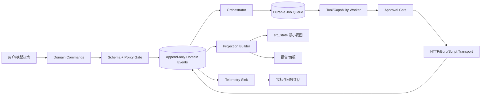

# dsh-src 优化方案实现细节手册

版本：v1.2（2026-09-12 能力评审增补）

日期：2026-09-12

v1.1 修订记录（对照 local.69 + Phase 0 工作区代码逐项复核）：

- §7 勘误：`src_state` 默认返回 v1 而非 v2（Phase 0 拍板，`flags.js` 已落地）。
- §5.2 补充 telemetry 模块已实现状态与设计稿偏差；Phase 1 标注半途。
- §6/§11 Phase 3 加范围声明：on 模式（lease/后台 tick）依赖宿主钩子，本轮只做 shadow。
- 新增 Phase 0.5：两处 #11b 相关代码缺陷修复（`src_submit` items required 残留、`victimImpact` 重复键），P0 先行。
- §12.3 回归数 168→169 并补第 5 类靶场场景；§12.4 A/B 口径与计划文档 §10 统一。
- §13.3 新增部署清单纪律（local.67 事故 6e1faf4 教训）。
- 本手册所有基线数字（测试数、字符数、预算阈值、flag 默认值）以 `docs/optimization-baseline-2026-09-12.md` 为唯一维护源；正文数字截至 Phase 0（commit 18e4b16，169/169、13106/7929/14081）。

v1.2 修订记录（对照 clown-src-6k-skill 能力评审）：

- 评审结论：Phase 0–6 完成后单目标工程可靠性持平或局部反超，但存在两个结构性产出口径缺口——测绘（目标从哪来、怎么穷尽）与打法模式库（高危招式密度）。新增 Phase 7、Phase 8 补齐。
- Phase 7 测绘：FOFA 为可选依赖，**无 key 时全流程降级可用**（种子队列/存活筛选/一种子闭环均不依赖 FOFA）。
- Phase 8 打法库：pattern 四列结构 + 服务端沉淀门槛，种子数据源为本地 clown-src-6k-skill 打穿短表（86 行）。
- Phase 7/8 引入的新数字（pattern 行数与预算、种子预算）落地时须同步写入基线文档。

适用范围：`/Users/lihua-dis/Software/dsh-src` 当前 Node.js ESM 实现、SRC 工具协议、会话投影、能力/Skill 路由和本地 lessons。

关联材料：

- [架构、提示词与 Skill 路由审计](architecture-prompt-skill-audit-2026-09-12.md)
- [约束减法论证](plan-2026-09-08-constraint-reduction.md)
- 顺丰考勤系统会话：`session-77038149-c955-408b-b65b-377766d82e21`
- Cairn 对照报告：`/Users/lihua-dis/Downloads/顺丰科技香港中转场签到系统渗透.html`

本文是实现手册，不是再次复盘。目标是把已经确认的问题变成可排期、可测试、可回滚的工程改造。

## 1. 先给结论

当前最需要优化的不是继续增加提示词规则，也不是先重写所有 Skill。优先级应当是：

1. **先建立 telemetry**，定义并记录 Skill、intent、审批、证据和上下文成本漏斗；没有这一步，无法证明“Skill 激活率低”到底是路由、模型遵循、审批摩擦还是能力本身无效。
2. **把异步编排从模型移到服务端 orchestrator/scheduler**。模型负责研究判断和优先级，服务端负责队列、依赖、超时、重试、orphan 恢复和幂等。
3. **把 `src_state` 改成结构化最小决策视图**。事实正文按 ID 拉取，模型默认只看到下一动作、阻塞原因、正在运行的工作和收官阻塞。
4. **收敛规则真相来源**。store/schema 是法律；工具描述负责参数和错误修复；主 prompt 只保留角色、授权和主循环；Skill 只写专题打法；lesson 只存历史经验。
5. **最后再升级 Skill manifest 和语义路由，并缩短 prompt**。先有数据，再调路由和提示词，避免凭感觉把规则在更多文件中复制一遍。

顺丰会话显示了这条顺序的必要性：主会话 42 turns、138 steps、290 次结构化工具调用，发生 6 次压缩；会话家族 9 个会话合计 1000 次工具调用，但 `src_list_capabilities`、`src_read_capability`、`src_run_capability` 均为 0。唯一入库 finding 为 low，旧版 medium+ 门槛阻止了 low-only 报告交付；97 个 fact 全量渲染又放大了上下文压力。Cairn 报告则以 16 条可复现 low finding 完成交付，说明核心差距首先在编排、证据和交付，而非调用了多少 Skill。

## 2. 目标、非目标和验收原则

### 2.1 目标

- 任意一个 intent 都能回答：当前状态、下一动作、阻塞原因、责任者、超时点、证据入口。
- 每次能力候选都能追踪 `offered → selected → read → run → approval → outcome → evidence → finding/research`。
- 子代理失联后由系统自动识别、限次恢复或标记失败，模型不再手工扫描一整张状态图。
- 事实、finding、观察和审批的正文只在必要时注入；默认上下文保持稳定上限。
- 修改一条硬规则时只有一个可执行真相来源，其他层不再复制完整门禁。
- low 级、可复现的未授权访问可以交付；限制、未测项和静态链在报告中清晰标注。

### 2.2 非目标

- 本阶段不重写整个 dsh 宿主、不更换模型供应商、不改变授权审批的安全边界。
- 不把所有人工判断机械化。资产归属、研究假设、危害链和是否停止仍由模型/用户决策。
- 不把关键词路由一次性删除。先兼容现有 `routePlaybook`，以结构化 manifest 做重排，数据稳定后再下线旧召回。
- 不追求 prompt 字符数的极小值。验收看行为指标、上下文成本和产出质量。

### 2.3 四条实现原则

1. **服务端状态优先于提示词状态**：可以验证、去重、超时或拒绝的规则写代码。
2. **命令产生事件，投影只读事件**：禁止 store 和 projection 各自拼接同一业务语义。
3. **证据先保存，报告后渲染**：响应体、请求形态、状态变化和限制条件必须能按 ID 回放。
4. **所有自动动作可解释、可停止、可回滚**：队列任务带原因、幂等键、重试预算和 feature flag。

## 3. 目标架构



### 3.1 当前模块到目标模块的映射

| 当前模块 | 当前职责 | 目标职责 | 首批动作 |
|---|---|---|---|
| `lib/src.js` | prompt、schema、projection、能力加载、工具接线混合 | 组合根和兼容导出 | 先抽 `domain/`、`projection/`、`orchestrator/` 的纯函数 |
| `lib/src/store.js` | durable domain、门禁、生命周期 | 命令处理和领域事件写入 | 保留现有 API，增加事件返回值和幂等键 |
| `lib/src/tools/index.js` | 约 44 个工具、长状态渲染、网络编排 | 薄工具适配层 | 工具只校验参数、调用 command/service、返回结构化结果 |
| `lib/src/playbooks.js` | substring 召回 | 兼容召回器 | 增加 manifest、分数、冲突和理由 |
| `lib/src/lessons.js` | 文件索引、触发提示 | pull 型经验库 | 记录 read/use 事件，禁止承担硬门禁 |
| `lib/src/state.js` | 少量运行时 Map | scheduler lease、退避和进程内缓存（on 模式，已推迟） | 不存唯一事实，重启可从 durable job 恢复；本轮仅 shadow 模式、不依赖 lease（见基线文档「明确不做」第 1 条） |
| `lib/src/mutations.js` | synthetic projection event | 迁移兼容层 | 逐步改为 domain event append |
| `lib/src/reporting.js` | 纯报告投影 | 保持纯函数 | 只从 projection/evidence index 读，不主动查网络 |

建议目录（可以渐进创建，不要求一次搬完）：

```text
lib/src/
  domain/
    schemas.js
    commands.js
    events.js
    policies.js
  projection/
    reducer.js
    views.js
  orchestrator/
    planner.js
    scheduler.js
    transitions.js
    recovery.js
  capabilities/
    manifest.js
    registry.js
    router.js
  telemetry/
    events.js
    sink.js
    budget.js
  transport/
    http.js
    approval.js
```

## 4. 领域对象和数据模型

### 4.1 新增 `orchestration_jobs`

它表示“系统需要执行的一项工作”，与 `srcIntent` 的研究目标分开。一个 intent 可以生成多个 job，一个 job 只能有一个当前执行者。

```js
{
  id: "job-42",
  sessionId: "session-...",
  intentId: "intent-3",
  kind: "capability.run",       // tool.call | capability.run | recovery | finalize-check
  action: "src_http",
  payloadRef: "payload-...",    // 正文在安全存储，状态视图只返回摘要
  status: "queued",             // planned|queued|running|waiting-approval|blocked|completed|failed|orphaned|recovered
  priority: 7,
  dependsOn: ["job-40"],
  idempotencyKey: "intent-3:src_http:sha256:...",
  attempt: 0,
  maxAttempts: 2,
  leaseOwner: "worker-1",
  leaseUntil: 0,
  nextRunAt: 0,
  timeoutMs: 120000,
  lastErrorCode: "",
  createdAt: 0,
  updatedAt: 0,
  completedAt: 0
}
```

硬规则：`idempotencyKey` 唯一；同一 key 的重复命令返回已有 job；`payloadRef` 不把完整响应体塞进普通状态视图。

### 4.2 新增 `route_candidates`

它记录路由当时提供了什么、为什么选中或跳过，避免把“没有调用 Skill”误判成模型问题。

```js
{
  id: "route-9",
  sessionId: "session-...",
  intentId: "intent-3",
  skillId: "authorization",
  score: 0.86,
  rank: 1,
  offered: true,
  selected: false,
  selectedReason: "已有同类 intent 正在运行",
  matchedSignals: ["asset.endpoint", "response.id"],
  rejectedSignals: ["forbiddenWhen: no-object-id"],
  createdAt: 0
}
```

### 4.3 新增 `evidence_links`

不要让 `pocEvidence` 同时承担自由文本、fact ID 和原始响应。新增索引后保持向后兼容：旧 `pocEvidence` 继续渲染，新写入优先使用结构化链接。

```js
{
  id: "evidence-link-7",
  sessionId: "session-...",
  sourceType: "observation",   // fact|observation|response|checkpoint|research
  sourceId: "observation-12",
  targetType: "finding",
  targetId: "finding-2",
  relation: "supports",         // supports|contradicts|context|reproduces
  excerpt: "status=200; body hash=...",
  createdAt: 0
}
```

### 4.4 `telemetry_events`

事件采用追加写入，默认按 session 保留 90 天；大 body 和原始授权说明不直接塞入常驻状态视图。事件失败不能阻塞核心工具。

```js
{
  id: "trace-...:17",
  traceId: "trace-...",
  spanId: "span-...",
  parentSpanId: "span-...",
  sessionId: "session-...",
  engagementId: "session-...",
  intentId: "intent-3",
  jobId: "job-42",
  event: "capability.outcome",
  occurredAt: 0,
  actor: "model|user|orchestrator|worker",
  model: "provider/model-version",
  promptTokens: 0,
  stateTokens: 0,
  payload: {},
  schemaVersion: 1
}
```

## 5. Telemetry 实现

### 5.1 事件清单

| 事件 | 触发点 | 必填 payload | 成功定义 |
|---|---|---|---|
| `route.offered` | intent 创建/重新规划 | skillId、score、rank、signals | 候选已写入 |
| `route.selected` | 模型或 orchestrator 选中 | skillId、reason、override | 有明确选择理由 |
| `skill.read` | `src_read_capability` 或 `src_read_lesson` 成功 | skillId、source、bytes | 正文读取成功 |
| `capability.requested` | `src_run_capability` 入队 | capabilityId、jobId、approvalRequired | job 已创建 |
| `approval.waiting` | 高危请求挂起 | approvalId、category、risk | pending 已持久化 |
| `approval.resolved` | 用户批准/拒绝 | approvalId、decision、latencyMs | 状态从 pending 迁移 |
| `capability.outcome` | 能力/工具结束 | jobId、status、errorCode、durationMs | 有终态或明确 blocked |
| `evidence.created` | fact/observation/research 写入 | evidenceType、evidenceId、source | 记录可回读 |
| `evidence.linked` | 证据关联 finding/intent | sourceId、targetId、relation | 关系可回放 |
| `intent.completed` | checkpoint completed 或自动收尾 | intentId、evidenceCount | 状态迁移成功 |
| `intent.recovered` | orphan 恢复成功 | intentId、attempt、childSessionId | 新 checkpoint 或终态 |

### 5.2 发射器接口

实现状态（2026-09-13 已完成，local.70 commit 5114005）：三模块已提交、17 类发射点全接线进工具执行路径、deploy 清单已补齐。实现与本节设计稿的偏差以代码为准：`createTelemetry` 内置 pending 写入追踪、测试钩子 `flush()` 与 `enabled()` 开关；事件 id 为 `randomUUID()` 而非 `traceId:timestamp` 拼接；sink 目录默认 `~/.dsh/storages/src-telemetry`（env 可覆盖），单事件预算硬顶 4KB。验收遗留：顺丰回放需待真实会话重跑后核对漏斗（见 Phase 1 验收段「route 级漏斗以新会话为准」）。

新增 `lib/src/telemetry/events.js`：

```js
export function createTelemetry({ sink, clock = Date }) {
  return {
    emit(event, context = {}, payload = {}) {
      const row = normalizeAndBudget({
        id: `${context.traceId ?? crypto.randomUUID()}:${clock.now()}`,
        event,
        occurredAt: clock.now(),
        ...context,
        payload
      });
      // telemetry 不能阻塞工具；sink 失败只进入内部计数器和 stderr。
      Promise.resolve(sink.append(row)).catch(() => undefined);
      return row.id;
    }
  };
}
```

工具执行上下文统一生成 `traceId`，子会话继承 `engagementId` 并生成新的 `spanId`。`src_http`、审批重放、能力脚本和子代理 checkpoint 都必须带上同一组关联字段。

### 5.3 数据体积规则

- telemetry 记录请求的 host/path、方法、状态、耗时、响应长度和 evidence id。
- 大 body 继续沿用现有 2KB 截断、hash 去重和按 ID 拉取，避免常驻状态无限膨胀。
- 原始正文保存在 evidence 存储中，默认状态只显示摘要和索引。

### 5.4 指标口径和聚合示例

Skill 漏斗必须按 `intentId` 作为基本分母，不能用工具调用总数代替：

```text
offer_rate       = intents_with(route.offered) / eligible_intents
selection_rate   = intents_with(route.selected) / intents_with(route.offered)
read_rate        = intents_with(skill.read) / intents_with(route.selected)
run_rate         = intents_with(capability.requested) / intents_with(skill.read)
approval_rate    = approvals_resolved / approvals_waiting
outcome_rate     = outcomes_terminal / requested_jobs
evidence_rate    = intents_with(evidence.created) / requested_jobs
finding_rate     = intents_with(finding_linked) / intents_with(evidence.created)
```

建议先用 JSONL sink 验证字段，再接项目现有 storage domain。聚合可以先用 Node 脚本完成，SQL 仅作为查询口径示意：

```sql
SELECT skill_id,
       COUNT(DISTINCT CASE WHEN event = 'route.offered' THEN intent_id END) AS offered,
       COUNT(DISTINCT CASE WHEN event = 'skill.read' THEN intent_id END) AS read_count,
       COUNT(DISTINCT CASE WHEN event = 'capability.outcome'
                            AND payload_status IN ('completed','blocked','failed')
                           THEN intent_id END) AS terminal,
       COUNT(DISTINCT CASE WHEN event = 'evidence.linked'
                           THEN target_id END) AS findings
FROM telemetry_events
GROUP BY skill_id;
```

每周人工抽样 20 个 intent 标注“应该使用的 Skill”，计算 route precision/recall。只有当漏斗和标注集稳定后，才调整阈值。

## 6. Orchestrator 和 Scheduler

范围声明：本轮只落 shadow 模式（`transitions.js` 纯函数迁移校验 + 建议事件，不执行）。§6.2 scheduler 循环、§6.3 重试预算的后台执行、§6.4 自动恢复均属 on 模式规格，依赖宿主后台 tick/生命周期钩子——已列入基线文档「明确不做」，另立项目后再实施。

### 6.1 状态机

```text
planned
  └─ enqueue ─> queued
queued ── lease ─> running
running ── high-risk ─> waiting-approval
waiting-approval ── allow ─> queued
waiting-approval ── reject/expire ─> blocked
running ── retryable error ─> queued
running ── timeout/lease lost ─> orphaned
running ── success ─> completed
running ── non-retryable error ─> failed
orphaned ── recover ─> recovered ── resume ─> queued
orphaned ── budget exhausted ─> failed
```

状态迁移由 `transitions.js` 的纯函数校验，禁止工具直接写任意 status：

```js
const ALLOWED = {
  planned: ['queued', 'blocked'],
  queued: ['running', 'blocked'],
  running: ['waiting-approval', 'queued', 'completed', 'failed', 'orphaned'],
  'waiting-approval': ['queued', 'blocked'],
  orphaned: ['recovered', 'failed'],
  recovered: ['queued'],
  completed: [], blocked: [], failed: []
};
```

### 6.2 Scheduler 循环

每 1 秒或由事件唤醒一次，执行顺序固定：

1. 读取 `queued` 且 `nextRunAt <= now` 的 job。
2. 检查依赖是否全部 `completed`；未满足则保留 queued 并写 `blockedReasons`。
3. 用 compare-and-swap 写入 `leaseOwner`、`leaseUntil`，防止多 worker 重复执行。
4. 调用 worker；所有工具结果转换成 domain event，再由 reducer 更新状态。
5. 对网络超时、供应商暂时不可用、429/5xx 使用指数退避；对参数错误、越权和审批拒绝不自动重试。
6. lease 超时的 running job 转 `orphaned`，交给 recovery policy。

伪代码：

```js
async function tick(now) {
  for (const job of await queue.claimable(now, 20)) {
    if (!await queue.claimLease(job.id, workerId, now + job.timeoutMs)) continue;
    try {
      const result = await worker.run(job, { signal: timeout(job.timeoutMs) });
      await commands.recordOutcome(job, result);
    } catch (error) {
      await commands.recordFailure(job, classify(error));
    }
  }
}
```

### 6.3 重试和超时预算

| 类别 | 默认次数 | 退避 | 说明 |
|---|---:|---|---|
| provider unavailable、网络连接失败 | 2 | 2s、8s | 不重复发送已批准的破坏性请求，需新 approval |
| 429、临时 5xx | 2 | `Retry-After` 或 5s、20s | 记录 rate-limit 证据 |
| 415、400 参数错误 | 0 | 无 | 返回请求形态诊断，交给模型修正 |
| approval pending | 0 | 等待事件 | 不轮询、不重发 |
| child orphan recovery | 每 intent 2 次 | 立即、5 分钟 | 仍失败就写 fact、标 failed、生成新 job |

### 6.4 Orphan 恢复

恢复条件沿用当前 `src_state` 的 checkpoint 规则，但由 scheduler 自动执行：

- running 且无 checkpoint：标记 `orphaned`，若仍有 childSessionId，入队 `recovery`。
- 最新 checkpoint 为 `progress` 且超过 30 分钟：同上。
- 恢复成功：写 `intent.recovered` 和新的 `checkpoint`；恢复失败：写 `blocked`/`failed`，保留已有事实，不删除图。
- 恢复任务必须带 `recoveryOfJobId`，防止恢复任务再次被当作普通研究任务重复派生。

## 7. `src_state` 结构化最小视图

当前 `src_state` 同时承担面板、证据浏览器、恢复器、覆盖检查和报告提示，导致 97 facts 等长文本重复注入。目标输出如下：

```json
{
  "version": 2,
  "goal": {"target": "example.test", "objective": "authorized assessment"},
  "counts": {"intents": 11, "facts": 97, "findings": 1, "assets": 11},
  "nextActions": [
    {"id": "job-42", "kind": "review-response", "priority": 8, "reason": "415 requires Content-Type check", "sourceId": "observation-19"}
  ],
  "blockedReasons": [
    {"code": "approval.pending", "id": "approval-7", "action": "ask-user"}
  ],
  "runningWork": [
    {"intentId": "intent-3", "jobId": "job-40", "status": "running", "leaseUntil": 0}
  ],
  "evidenceIndex": {
    "recent": ["observation-19", "fact-91"],
    "byIntent": {"intent-3": {"count": 12, "lastId": "fact-91"}},
    "omitted": 73
  },
  "skillHints": [
    {"skillId": "authorization", "score": 0.86, "reason": "object id + authenticated endpoint"}
  ],
  "finalizeBlockers": [],
  "warnings": ["remainingDirections=1"]
}
```

实现方式：

1. `src_state` 默认返回 v1（Phase 0 勘误：本条原文「默认 v2」与 §13.1 灰度顺序矛盾，按灰度原则默认 1，已落地 `DSH_SRC_STATE_VERSION=1`，A/B 数据达标后再翻默认）；v2 经 `detail="summary"` 或 flag=2 显式启用；`detail` 参数全集：`summary`、`evidence`、`orchestration`、`legacy`。
2. `summary` 只返回上例字段，事实正文不超过最近 12 条；finding 相关证据永不被预算裁剪。
3. 新增 `src_get_evidence({ ids, full })`，按 ID 拉取正文，复用现有 `http-output.js` 截断和去重。
4. 保留 v1 兼容窗口 30 天；旧模型检测到 `version=1` 时仍可拿到旧字段，但不再作为默认 prompt 输入。
5. `src_report` 和面板使用 projection 的分页接口，报告生成前才拉取 finding 所需完整证据。

验收：同一顺丰规模的 97 facts 会话，默认 `src_state` 文本 token 降低 60% 以上；finding、intent、pending approval 和 orphan 信息不可丢失。

## 8. Skill manifest 与语义路由

### 8.1 Manifest 格式

在 `preset/src-hunter/skills/*.manifest.json` 或能力索引中增加：

```json
{
  "id": "authorization",
  "version": "1.0.0",
  "assetTypes": ["endpoint", "web", "api"],
  "triggers": {
    "terms": ["越权", "IDOR", "对象权限"],
    "signals": ["response.objectId", "multiAccount", "authRequired"]
  },
  "prerequisites": ["asset.confirmed", "baseline.available"],
  "forbiddenWhen": ["no-object-id", "out-of-scope"],
  "requiredTools": ["src_http", "src_record_research", "src_add_finding"],
  "outputSchema": ["baseline", "crossAccountDiff", "evidenceIds"],
  "expectedEvidence": ["beforeResponse", "afterResponse", "identityContext"],
  "cost": {"tokens": 900, "requests": 8},
  "risk": "medium",
  "docs": ["skills/skill/知识库/idor-test.md"]
}
```

通用 finding 门禁不得复制进 manifest；manifest 只描述这个专题需要什么证据。

### 8.2 路由评分

保留 `routePlaybook` 作为高召回召回器，新增重排：

```text
score = 0.30 * semanticSignal
      + 0.20 * assetTypeMatch
      + 0.20 * prerequisiteMatch
      + 0.15 * evidenceGapMatch
      + 0.10 * historicalOutcome
      - 0.15 * forbiddenSignal
      - 0.10 * duplicateRunningIntent
```

- `semanticSignal` 第一版可用 terms + 中文同义词；后续再接 embedding，避免一开始引入新运行时依赖。
- `historicalOutcome` 只使用 evidence/finding 关联数据，不能按调用次数奖励噪声。
- 取 top-3，低于 0.45 只返回 `recon` 兜底并标记低置信度。
- 多 route 冲突时，按分数、前置条件满足数、风险低者排序；理由写入 `route_candidates`。
- 用户或模型可以 `override`，但必须记录 `actor`、理由和过期范围。

### 8.3 Skill 激活的产品定义

“激活”不能定义成“关键词命中”。建议分三档：

- **发现激活**：候选被提供并有 route 事件。
- **执行激活**：文档被读取且至少一个 required tool/job 被调用。
- **有效激活**：执行产生 expected evidence，并被关联到 finding、research 或明确 blocked 结论。

报告中同时显示三种率，避免用一个百分比掩盖审批失败或证据不足。

## 9. Prompt、工具描述和规则分层

### 9.1 规则优先级

```text
store/schema/approval gate  >  工具参数和错误描述  >  主 prompt 决策原则
                             >  Skill 专题打法      >  lesson 历史经验
```

发生冲突时，工具返回的可执行错误和服务端 gate 优先；模型只需根据错误修复或换方向。

### 9.2 主 prompt 三段式

把 `SRC_INSTRUCTIONS` 收敛为三块，目标约 3.5k–5k 字符：

```text
角色与边界
- 只在授权资产上工作；授权由 goal、资产清单和审批层执行。
- 你负责研究判断、优先级、证据解释和最终交付。

主循环
1. 读 src_state(summary)，选择一个 nextAction 或建立 intent。
2. 需要专题时读取候选 Skill；按 requiredTools 形成最小任务。
3. 委派后等待事件；根据 evidence 更新事实、research 或 finding。
4. 没有可执行动作时运行 finalize，并如实记录限制。

恢复与交付
- 遇到 blocked/approval/orphan，按结构化 reason 处理，不轮询、不重复发送。
- low 级可复现结果也可交付；证据不足就保留为 fact/research。
- 报告必须区分动态实证、静态链、blocked 和未授权验证边界。
```

移出主 prompt 的内容：完整字段表、审批分类、Burp 用法、验证码/短信预算、每个漏洞专题检查项、报告模板字段和所有可由 schema 拒绝的格式规则。

### 9.3 工具 description 写法

每个 description 只回答四件事：输入是什么、何时可调用、失败表示什么、下一步应该看哪个字段。不要在 description 重复整个主 prompt。

例如 `src_http` 保留：“高风险请求返回 pending，必须等待用户决定；批准后响应包含 status、headers 摘要、body 摘要和 hash；415/400 不自动重试，先修正请求形态。” 其余安全政策由 `classifyHttpRequest` 和 approval gate 执行。

## 10. Store、事件和 Projection 收敛

> ✅ **已完成（local.77）**：src_events 表（srcDomainSpec version 12→13，zod schema id/sessionId/eventType/eventId/payload/createdAt）+ 5 条写路径插桩（addNode/edges/updateIntent/addCheckpoint/resolvePendingApproval，均先 appendEvent 再 put 快照）+ 幂等键 aggregateId:aggregateVersion:eventType + 纯 reducer 双折叠（replaySrcEvents/reducerStateHash FNV-1a/doubleFold）+ 五条一致性断言（assertStoreProjectionConsistency，src_state 观测点 shadow 发 projection.divergence，永不阻塞）+ DSH_SRC_EVENT_STORE off|shadow|on 开关（默认 off，零新增写入；修复 enabled() 真值判断 bug——"off" 是 truthy，改显式 `=== "off"`）。新模块 lib/src/event-store.js，lib/src.js 只留接线。4 条新增测试；188/188 全绿 + check-preset-consistency OK。

### 10.1 迁移策略

不直接重写 `lib/src.js` 的 projection。分四步：

1. **兼容层**：为现有 `store.addFact/addFinding/updateIntent` 返回 `{ value, events }`，同时继续提供旧返回形状。
2. **事件落盘**：新增 `src_events` 表，事件包含 `eventId`、`aggregateId`、`aggregateVersion`、`payload`、`createdAt`；所有领域写入先 append，再由现有 domain table 更新快照。
3. **双折叠校验**：测试环境和灰度环境同时用旧 projection、新 reducer 生成 snapshot，比较 intent/fact/finding/checkpoint/approval 的关键字段并发 `projection.divergence`。
4. **切换读取**：默认读取新 reducer；保留旧 projection replay 30 天用于回滚。确认 divergence 为零后，删除 synthetic event 的新增入口，旧入口只读历史。

### 10.2 事件幂等

- 事件键：`aggregateId:aggregateVersion:eventType`。
- 重放遇到已有 eventId 必须返回 duplicate，不再次追加边。
- projection reducer 必须纯函数；同一事件序列重复 fold 得到相同 hash。
- 每个 checkpoint、approval resolution 和 finding update 都必须可重放。

### 10.3 关键一致性断言

- store 中存在的 active finding 必须在 projection 中存在。
- `pending_approvals.status=pending` 必须出现在 `blockedReasons`。
- completed intent 必须有 completed checkpoint，除非标记为系统迁移产生。
- evidence link 的 source/target 必须属于同一 engagement 或有明确跨会话边界。
- projection 不得生成 store 不存在的 id。

## 11. 分阶段实施计划

### Phase 0：基线、开关和回滚（1–2 天）——✅ 已完成（2026-09-12，commit 18e4b16：flags 四开关全惰性求值+非法值回落、基线文档入库、deploy 清单加 flags.js，169/169 绿；默认 telemetry=shadow、state=1、orchestrator=off、route_v2=off）

任务：

- 建 `optimization/handbook` 对应 issue 清单和变更记录。
- 增加环境变量：`DSH_SRC_TELEMETRY=off|shadow|on`、`DSH_SRC_STATE_VERSION=1|2`、`DSH_SRC_ORCHESTRATOR=off|shadow|on`、`DSH_SRC_ROUTE_V2=off|shadow|on`。
- 为当前 domain、session projection 和 lesson 目录做只读备份；保存 `npm test` 基线。

验收：关闭全部 flag 时 `node scripts/check-preset-consistency.mjs` 和 `npm test` 与当前一致。

### Phase 0.5：#11b 相关代码缺陷修复（P0，先行于 Phase 1 与顺丰重跑）

2026-09-12 代码复核实测发现两处缺陷：#11b（未授权可达+可复现 PoC 即 low 入库）目前只在父会话直连路径生效。

1. `src_submit` findings items 内嵌 schema 的 `victimImpact`/`concreteLossEvidence` 仍为 `required: true`（commit b410890 只放宽了 `src_add_finding` 参数层与 store 门禁）。宿主 `validateArgs` 在 execute 之前拦截——子代理按新语义提交三要素全缺的 low finding 会被整体拒绝（实测复现：`missing required property "findings[0].victimImpact"`）。顺丰重跑的 finding 验收（≥8）依赖子代理提交路径，此项不修则大概率半路失败。修法：items 内两字段转 optional、描述同步 #11b 语义；补「子代理经 `src_submit` 提交 low finding」回归（现有 #11b 测试只覆盖父会话 `src_add_finding` 直连，靶场 E2E 同样是父会话直连）。
2. `src_add_finding` 参数对象中 `victimImpact` 重复定义：#11b 版（optional+新语义）之后残留旧版键，JS 后键覆盖前键，模型实际看到的字段说明是旧版（无「low 可缺省」指引）。修法：删旧键；`check-preset-consistency` 增加参数对象重复键静态检查防复发。

验收：子代理路径 low finding（三要素全缺）经 `src_submit` 入库的回归通过；重复键检查进 CI；169/169 保持绿。

### Phase 1：Telemetry（3–5 天）——✅ 已完成（2026-09-13，local.70：commit 5114005+c555dd6，175/175 绿）

实现（实际落地情况）：

- 新增 `lib/src/telemetry/{events,sink,budget}.js`：fire-and-forget JSONL（`$DSH_HOME/storages/src-telemetry/src-telemetry-YYYY-MM-DD.jsonl`，日轮转、懒 mkdir、错误计数不抛）；emit 永不抛（循环引用吞掉）；单事件 4KB 预算（超限 `{truncated:true, head}` 渐进截断）。
- 17 类发射点全接线 `lib/src/tools/index.js`：route.offered/selected、evidence.created/linked(proves/verifies)、submit.checkpoint（跨会话 engagementId=父）、intent.completed、http.request（直发+审批重放 `replay:true`）、approval.waiting/resolved（含 latencyMs）、skill.read（lesson/capability-doc）、capability.requested/outcome、asset-attribution waiting、intent.recovered、engagement.finalized。
- `scripts/aggregate-src-telemetry.mjs`：漏斗（finding_rate 按会话去重）/skill 用率/审批率/http/token 体积（chars/4）/重复调用/orphan 报表，`--json` 机器可读；ENOENT 报「无数据」。
- `scripts/deploy.mjs` 清单已补 telemetry 三件（防 http-output 同类事故）。
- 回归 7 条：模块单元（预算/永不抛/off 不落盘/惰性目录）、wiring 全链路落 JSONL、http+审批事件、capability 事件、sink 失败不阻塞工具、off 零落盘；另有「telemetry 行不进会话日志/投影」红线测试。

验收：回放顺丰会话日志能得到工具调用级漏斗（read/run/submit/http 等）；`route.offered`/`route.selected` 等 route 级事件只对新会话生效（历史会话无这些事件、回放没有 route 分母），route 级漏斗以新会话为准；telemetry sink 故障不影响工具；事件和状态视图均遵守体积预算。

### Phase 2：结构化 State View（4–7 天）✅ 已完成（local.72，commit 8229c21）

实现（已落地）：

- ~~在 `lib/src/tools/index.js` 抽出 `buildSrcDecisionView`~~ → 实际实现：src_state execute 内 v2 视图分支（legacyView 提取为局部 const，三条 v2 视图在其后分支构建）。
- ~~增加 v2 schema、`src_get_evidence`、分页和 `detail` 参数~~ → 全部落地：`detail` enum 参数（summary/evidence/orchestration/legacy，非法值被 schema 闸直接拒——dsh-tools 对参数 enum 严格校验）；`src_get_evidence({ids, full})` 新工具（按 id 拉取 fact/obs/finding/asset/research/intent 正文，默认 4KB 截断、full:true 放宽 32KB、≤32 个 id）；未做分页（evidenceIndex.recent 12 + byIntent 计数已覆盖，按 id 拉取替代分页）。
- ~~保留 legacy render，但默认只返回 summary~~ → 默认仍 legacy/v1（DSH_SRC_STATE_VERSION=2 才切 summary；v1 兼容窗口 30 天，用户侧未切前不动默认——顺丰重跑链路零风险）。
- 增加 facts omitted、finding evidence 永不裁剪和关键 blocker 快照测试 → 全部落地（tests +1 = 177/177 绿：v2 三视图结构断言 + src_get_evidence 混合 id/未找到/截断/full + token 体积 < legacy×0.4 + flag=2 切换 + 工具清单冻结闸更新 45 工具）。
- 实现要点（防回炉）：①src_state 输出 schema 的 17 处 `required: true` 必须剥离（dsh-tools 对 output schema 强制 required 存在性校验，v2 输出缺 v1 数组字段会被拒；且 required 只能 true 或缺省，`required: false` 编译期报 unsupported schema）②v2 输出禁 undefined 污染（childSessionId ?? "" 同 local.15 口径）③新工具进工具清单冻结闸（tests local.50a）与 toolFilter deny 名单无关（deny 模式未 deny 即可用）。

验收（已达成）：31-fact 会话 v2 summary 视图 token 输出比 v1 降 ≥60%（测试断言 summaryChars < legacyChars×0.4）；报告和面板能按 ID 取回完整证（src_get_evidence 截断/full 双档断言）。

遗留（用户侧）：真实会话重跑后核对 v2 视图实际体验；DSH_SRC_STATE_VERSION=2 切换时机由用户拍板。据。

### Phase 3：Orchestrator/Scheduler（1–2 周）✅ 已完成（local.73，commit 381c9ab，2026-09-13）

实现（已落地，shadow）：

- 新增 `orchestrator/transitions.js`、`queue.js`、`scheduler.js`、`recovery.js` → 全部落地（shadow 纯函数）：transitions=§6.1 ALLOWED 表（表外迁移拒绝、终态零出边、ACTUAL/SUGGESTED 两状态空间分离）；queue=建议工厂（id 用 `sugg-` 前缀不冒充可执行 job）+ 幂等键 `${kind}:${intentId}:${extra}` 去重；scheduler=computeSuggestions 五类建议（enqueue/orphan-recover/approval-wait/user-todo/finalize）；recovery=orphan 判定（无 checkpoint 直接候选沿用 src_recover_child 语义；progress 超 30min → stale-progress）。
- 为 intent 创建、checkpoint、approval、child failure、finalize 创建 job → shadow 实现为一观测点集中计算：每次 src_state 调用视为调度器观测点，DSH_SRC_ORCHESTRATOR≠off 时从视图切片推导五类建议并旁路发射 `orchestrator.suggestion` 事件（永不进上下文/永不阻塞）；v2 orchestration 视图附 `shadowSuggestions` 供对照；off 模式零开销（无该字段、零事件）。
- shadow 模式只计算迁移和下一动作，不执行 → 严格执行：建议态（queued/waiting-approval/orphaned/recovered）永不写回 intents 表（ACTUAL/SUGGESTED 空间分离）；approval pending 不轮询不重发（手册明文）。
- ~~on 模式先接 recovery、timeout 和 finalize check~~ → 未实施（依赖宿主后台 tick/lease，属基线「明确不做」，另立项目）。

验收（已达成）：迁移建议事件（orchestrator.suggestion）与模型实际行为（intent.completed/intent.recovered/submit.checkpoint/approval.resolved）的对比报表可产出（aggregate-src-telemetry.mjs 新增 orchestrator 段：建议计数 by kind + 按 intentId 建议 vs 实际对照行）；重复 job（幂等键）不重复发建议（dedupeKey 去重测试断言）；批准前不会执行高危操作（shadow 不执行任何东西，天然满足）。tests 180/180 绿（+3：状态机表外拒绝/五类建议+幂等+orphan 30min 规则/观测点 shadow+off 零开销）。

遗留（on 模式另立项目）：宿主后台 tick/lease 钩子、lease 超时自动 orphaned、恢复任务带 recoveryOfJobId 防重复派生。

### Phase 4：规则真相收敛（1 周）✅ 已完成（local.74，commit 0d90cf3 + docs b6ad9e4）

实现（已落地）：

- 规则目录清单 `docs/rules-catalog.md`：服务端强制/工具层/经验库三层，逐条标 `enforcedBy`/`explainedBy`/`historicalSource`。
- 主 prompt 收敛：SRC_INSTRUCTIONS 7929→3502 字符，三段式（【主循环】/【角色与边界】/【恢复与交付】）；门禁细节（审批判据、Burp 三步、字段表、infra 沿用、范围校验语义）去重到工具 description 与 schema；四类不可编码原则保留（授权/禁止绕行/证据诚实/报告边界）并索引到服务端 gate。
- 验收：`[local.73 Phase 4]` contract test——finding 缺三要素拒、scope 范围外拒、finalize 待办硬拦 ready:false、allowIncomplete 缺 reason 拒，全部断言服务端 gate 优先（不依赖 prompt 文本）；181/181 绿。

### Phase 5：Skill Manifest 和 Router v2（1–2 周）✅ 已完成（local.75，commit 0500304）

实现（已落地）：

- `buildSkillManifest()` 17 路由完整元数据：id/title/terms（旧 terms 保留为召回字段）/docs/checks/prerequisites/stopConditions/requiredTools/expectedEvidence。
- `scoreRoutes()` 打分：title 命中 ×3、detail 命中 ×1、多 term 叠加，降序排序；不再单用 substring。
- `routePlaybookV2()`：candidates top-3 带分数，primary=最高分；keys/checks 语义与 legacy 完全一致（回归闸测试锁 4 组样例）；无命中 fallback 与 legacy 对齐（ROUTES[0]）。
- shadow evaluator：12 条人工标注集 top-1 precision 12/12=100%（≥90% 验收线）；route.offered/selected telemetry 带 candidates 落盘（phase 1 漏斗复用）。
- 人工 override：现有 route.selected 带 override 字段（false）；按意图改 playbook 经 src_update_intent 重路由实现。

验收（已达成）：top-1 precision 100%≥90%；v2/legacy keys 一致性回归闸；每个 selected route 经 playbook.checks 追踪到 read/run/outcome（skill.read/outcome 事件已有）。

### Phase 6：Prompt/Runtime 拆分（1–2 周）✅ 已完成（local.76，commit 0d4a954 + becb814）

实现（已落地）：

- SRC_INSTRUCTIONS 三段式 ✅（Phase 4，3502 字符）；专题打法已移到 manifest/lesson（Phase 5 buildSkillManifest + lesson hooks）。
- lib/src/capability-loader.js 抽离：parseCapsYamlSubset/readCapsManifest/capsWiredIds/capabilityCommand/runCapabilityProcess/runChildWithTimeout/SRC_INFRA_*（149 行原体搬迁，lib/src.js 2012→1864 行）；deploy.mjs 清单已同步。
- orchestrator 抽离 ✅（Phase 3，orchestrator/{transitions,queue,scheduler,recovery}.js 纯函数）。

验收（已达成）：prompt token −40%（3502 ≤ 4757 = 7929×0.6，锁进回归测试）；+1 拆分完整性回归（12 导出/不再内联/capabilityCommand 语义越界拒绝）；184/184 绿；replay/schema/审批 E2E 由全量测试套覆盖。

### Phase 7：测绘与种子闭环（可选立项，1–2 周，超越项）

> **状态：已完成（local.81，commit a53f434）。** 测试 200/200 绿（193+7）；工具级 description 合计 13665/15000（新增 src_survey_seed 402 字符，基线 13263→13665）；lessons 14081 不变。落地范围：`survey_seeds` 独立表（srcDomainSpec v13→v14）+`src_survey_seed` 七动作工具（add/list/next/complete/backfill/probe/fofa）+一种子闭环服务端闸（`next` 拒未闭环 active 种子）+存活分类纯函数（401/403/登录墙/挑战页判 alive）+FOFA 可选 provider（无 key 惰性降级，key 不进返回）+`DSH_SRC_SURVEY=off` 默认工具不注册（行为与 local.80 完全一致）+三个 subagent persona deny 追加 + `lib/src/survey.js` 进 deploy 清单。

动机（2026-09-12 能力评审实测）：现有工具面解决「给了目标怎么测」，不解决「目标从哪来、怎么穷尽」。对照报告 16 条 finding 中 9 条来自资产测绘面（同域多后端、相邻系统）；clown-src-6k-skill 的产出广度主要来自测绘引擎（种子无上限+一种子闭环+优质根域回灌）。这是 Phase 0–6 均未覆盖的缺口。

**FOFA 可选原则（硬性）**：无 FOFA key 时全部功能降级可用，不许出现「没 key 就不可用」的路径。种子队列、去重去废、存活筛选、一种子闭环、回灌队列均不依赖 FOFA；无 key 时种子来源=用户给定清单/宿主手动发现/JS 与回包中带出的新 host（现有 §4.1.3 线索回收的自然延伸）。有 key 时 FOFA 只是种子搜索的一个可选 provider。

实现：

- 新增 flag `DSH_SRC_SURVEY=off|shadow|on`（沿用 flags.js 惰性求值模式，默认 off，关闭时行为与当前完全一致）。
- 种子队列：新增 `src_survey_seed` 工具（动作：add/list/next/complete/backfill），种子状态 pending/active/done 复用 store 持久化（种子可作为 asset 的特殊 kind 或独立表，实施时按 store 现有结构选，避免引入第二事实源）。
- 一种子闭环（服务端硬闸，非提示语）：同一时间只允许一个 active 种子；该种子清洗后的活面未全部处置（挖完/记废/非存活/同皮代表已做）时，`next` 直接拒绝并返回剩余活面计数。这是 clown 版靠提示词纪律实现的东西，我们用代码闸——模型忘了纪律也绕不过去。
- 存活筛选：去重→去废（停放页/无业务响应）→非存活（超时/探不通）批量探测，复用 `http-output.js` 与代理通道；**401/403/登录墙/管理台挑战页判为存活不丢弃**（clown 实战口径：存活≠在登录表单上耗）。
- 股权闸（人工确认版）：全资 1–4 级主体名/品牌/根域建议入队、参股默认不挖的判定提示交给模型+用户确认，不自动调工商 API（数据源不稳定，先不接）。
- FOFA provider（可选）：key 从 env/宿主配置读，**禁止写进对话、文档、工具返回**；无 key 自动跳过该 provider 不报错；有 key 时实现翻页、限流退避（429 指数退避）、单种子搜索只围绕该种子。后续可扩展 hunter/shodan 等 provider，接口按 provider 抽象。
- 模式判定：用户给定 URL 清单/固定站=锁面（现有行为不变，禁出圈 FOFA）；模糊目标（只给集团名）=自由跳（新能力）。判定逻辑写进种子工具返回的引导语，不进协议常驻文本。
- 优质根域回灌：挖到优质面时把其注册根域作为新 pending 种子入队（backfill 动作），但 active 种子未闭环前不弹给模型。

验收：无 FOFA key 环境全流程可用（手动种子→闭环→done，一条 e2e 证明）；「剩余活面未挖完时 next 被服务端拒绝」有回归；401 站不被判死有回归；`DSH_SRC_SURVEY=off` 时工具面与当前完全一致；新增 `lib/src/` 子模块进 deploy.mjs 清单（§13.3）。

### Phase 8：打法模式库 pattern lessons（1 周，超越项）

动机（同评审）：打法知识密度缺口——内置 lessons 14.1k 字符偏纪律与流程；clown 打穿短表 86 行「认什么→打哪→出什么算成→假点」是具体高危招式（对象存储 STS 通配覆盖、假签 302 回显算出的签、GOPROXY hg 元数据、IMDS 405 转 GET、发签 nonce 是 PKCS8 私钥、云 IDE 弱口令→RPC RCE 链等），密度差约一个量级。且「假点」列（防把没打穿当洞、防把单站失败当手法失效）在现有 lesson 机制无对应物。

实现：

- 新 lesson 类型 `pattern`，四列固定结构：**认什么**（形态描述，禁止具体厂商/path/字段名）、**打哪**（试法，标不登录/要会话，两句封顶）、**出什么算成**（差分标准，必须能回答比基线多了谁的什么）、**假点**（形态级证伪条件，必填）。细节超两句的进对应模块篇，pattern 行只留指针。
- 存储与召回：复用 lesson 机制（goal 索引+决策点钩子），lesson-meta 加 `kind: pattern`；进站时按目标特征匹配召回（复用 playbook 路由的召回字段机制，特征词对齐 pattern 的认法关键词）。禁止每站通读全库——只召回匹配行。
- 沉淀门槛（服务端闸，防表膨胀）：`src_record_lesson(kind=pattern)` 强制四列齐全；认法做形态化校验（正则拦具体 path/域名/字段名枚举）；假点必填；同型已有 pattern 时拒绝新建、返回已有行让模型走「补差分」路径。普通 lesson 不受影响。
- 报告层吸收两闸（clown 实战打磨的防退回设计）：**匿名闸**——有会话禁标「匿名未授权」，改越权口径（src_report 渲染时校验 finding 的会话上下文标记）；**认钥闸**——凭证类 finding 未附「假值对照+认钥枪带出身份/列表」证据时，报告渲染显著警告（不阻塞入库，与 #11b 宽准入一致）。
- 种子数据导入：clown-src-6k-skill 打穿短表 86 行（`/Users/lihua-dis/Downloads/clown-src-6k-skill/skills/skill/知识库/打穿短表.md`，朋友授权的身份包）逐行转 pattern 四列格式入内置库；转换脚本一次性入库，密钥实值/完整 JS 地址不入库；导入后 pattern 行数与字符数进基线预算与 check-preset-consistency。
- 预算：pattern 库总量设闸（初版 ≤40k 字符，导入后实测再定），行数超过阈值时提示合并（并：同一认法多行合一；分流：细节进模块篇留指针），不自动删。

验收：pattern 四列结构校验+形态化校验进 check-preset-consistency；「同型 pattern 已存在时新建被拒」有回归；进站特征匹配能召回对应 pattern（至少 5 个目标特征用例）；匿名闸/认钥闸渲染路径各有回归；种子导入后 pattern 总量写入基线文档；169/169+新增回归全绿。

## 12. 测试和评估体系

### 12.1 单元与契约测试

- `transitions.test.mjs`：每个状态迁移和非法迁移。
- `telemetry-budget.test.mjs`：大 body、重复响应和长授权说明不会突破事件及状态视图预算。
- `router.test.mjs`：同义词、冲突 route、禁止条件、低分 fallback。
- `decision-view.test.mjs`：预算、分页、finding evidence 保留、v1/v2 兼容。
- `event-replay.test.mjs`：事件序列重复 fold 结果 hash 相同。

### 12.2 Property-based / Replay 测试

生成随机的 goal、intent、fact、checkpoint、approval 和 finding 事件序列，验证：

- reducer 不抛异常且不会生成孤儿 ID；
- duplicate event 不改变最终状态；
- store snapshot 与 projection 关键字段一致；
- 任意中断后恢复不会重复执行不可重试动作。

将顺丰主会话和会话家族日志制作离线 replay fixture，只复现状态迁移和工具调用，不重新访问目标；fixture 仅保留测试所需的结构化字段和体积边界。

### 12.3 Mock 靶场 E2E

保留现有 169 项回归（Phase 0 后），增加五类场景：

1. low-only 多 finding 可以 finalize 和出报告；
2. JSON body 缺 Content-Type 时自动补全，415 会返回 body 诊断；
3. 写入→回读→删除的三步证据链能关联到一个 finding；
4. provider unavailable、child orphan、approval pending 在 scheduler 中可恢复；
5. 子代理经 `src_submit` 提交三要素全缺的 low finding 可入库（Phase 0.5 #1 的回归）；
6. （Phase 7）无 FOFA key 时种子闭环全流程可用；active 种子剩余活面未挖完时 `next` 被服务端拒绝；401/403 站判存活不丢弃；
7. （Phase 8）pattern 四列不全/认法含具体 path 时 `src_record_lesson` 被拒；同型 pattern 已存在时新建被拒；有会话的 finding 报告渲染出匿名闸警告。

### 12.4 Agent A/B 评估

固定同一目标、授权、模型版本和预算，比较：

- prompt 旧版 vs 三段式；
- substring route vs Router v2；
- legacy state vs decision view v2；
- orchestrator off vs on。

每组至少 20 个 intent 或 30 分钟（先到为准，与计划文档 §10 A/B 口径统一），记录 route precision/recall、skill 有效激活率、工具重复率、上下文 token、orphan/recovery、finding 数量和人工可交付率。不要只以 finding 数量为 KPI，必须同时看误报、越权和清理完整性。

## 13. 灰度、迁移和回滚

### 13.1 灰度顺序

1. telemetry shadow（100% 会话，只写结构化事件）；
2. state v2 对内部测试会话 10%；
3. orchestrator shadow 100%，执行仍由旧路径；
4. orchestrator on 仅用于低风险 recovery/finalize check；
5. Router v2 shadow，比较候选不改变选择；
6. Router v2 on 10%→50%→100%；
7. prompt 三段式最后灰度，保留旧 prompt 版本号。

### 13.2 回滚条件

任一条件触发立即关闭对应 flag：

- projection divergence > 0.5%；
- 高危请求出现未审批执行；
- 重复不可重试请求 > 0；
- orphan recovery 产生重复 finding 或重复外发；
- state v2 隐藏 pending approval、active finding 或授权边界；
- 有效激活率下降超过 20% 且 route recall 未提升。

回滚只切 flag，保留事件和 job 记录。不要删除新事件或清空 durable store，以便定位和重放。

### 13.3 部署清单纪律

新增 `lib/src/` 子模块（如 `http-output.js`、`flags.js`、`telemetry/`）必须同 commit 更新 `scripts/deploy.mjs` 清单。local.67 事故（commit 6e1faf4）：#17 新模块 `http-output.js` 未进清单，线上副本 import 失败导致 preset 挂载失败。Phase 1 提交 `telemetry/` 时必须同步补清单。

## 14. 风险清单和应对

| 风险 | 影响 | 预防/处理 |
|---|---|---|
| telemetry 自身膨胀上下文 | token 增加 | telemetry 永不注入 prompt，单独 sink；状态只读聚合计数 |
| scheduler 与旧模型同时执行 | 重复请求 | shadow 阶段只建议；on 阶段以 idempotencyKey 和 lease 锁定 |
| 自动恢复误判 orphan | 重复委派 | recovery 只恢复 checkpoint 缺失/超时任务，超过预算标失败并要求模型决策 |
| route manifest 过严漏召回 | 漏测 | terms 保留高召回，manifest 只做重排；低分 fallback recon |
| 事件和快照不一致 | 面板/报告分叉 | append + snapshot 同一 command；定期 divergence replay |
| 响应体摘要过短 | 证据不可用 | `full=true` 受控拉取；记录 hash、长度和 content-type |
| prompt 变短后行为退化 | 研究漏项 | A/B、人工标注集、固定靶场和快速回滚 |
| 测绘自由跳扩面失控 | 越权/打无关资产 | 一种子闭环服务端硬闸；锁面默认禁出圈；授权边界仍以 asset 清单为准；FOFA 无 key 自动降级 |
| pattern 库膨胀或误报 | 知识库变噪音、假洞入库 | 四列强校验+形态化正则+假点必填+总量预算闸；同型拒绝新建；出什么算成必须写差分标准 |

## 15. 30/60/90 天排期

### 0–30 天：看得见、稳得住

- 完成 telemetry、体积预算、trace/span 和聚合脚本。
- 完成 state v2 summary、evidence index、`src_get_evidence`。
- 建立顺丰日志 replay fixture 和四类新增 E2E。

交付标准：能回答每个 intent 为什么选/没选某 Skill；97 facts 会话不再因状态渲染触发 oversized；现有 169/169 回归保持通过。

### 31–60 天：编排自动化

- 完成 job schema、状态迁移、lease、退避、approval 事件。
- scheduler shadow 两周，比较建议动作和模型实际动作。
- 上线 orphan/recovery/finalize check 的低风险自动化。
- 开始事件来源单一化迁移和 projection divergence 监控。

交付标准：子代理失联可自动恢复或明确失败；高危动作没有绕过审批；重复 job 不重复执行。

### 61–90 天：路由和 prompt 收敛

- 完成 17 个 Skill manifest、Router v2 和人工 override。
- 完成 prompt 三段式和工具 description 清理。
- 完成 A/B 评估、route 标注集和最终灰度。
- 删除不再使用的 synthetic event 新写入口，保留历史 replay。

交付标准：有效 Skill 激活率、finding 交付率、重复调用率和上下文成本都有可比较的基线；没有用“调用次数增加”冒充质量提升。

### 91–120 天：测绘与打法库（Phase 7/8，超越项，可选立项）

- Phase 7 测绘：种子队列+一种子闭环硬闸+存活筛选先行；FOFA provider 视 key 到位情况随时可插（无 key 不阻塞）。
- Phase 8 打法库：pattern 四列结构+沉淀门槛+打穿短表 86 行导入；匿名闸/认钥闸进报告渲染层。

交付标准：模糊目标（只给集团名）可自主完成种子→闭环→换种的完整测绘循环；进站能召回匹配 pattern 并在报告层拦住匿名/认钥口径错误；两 Phase 新数字全部进基线。

## 16. 首批可直接建 issue 的任务

Phase 0.5 的两项 P0 缺陷修复优先于本清单全部任务。任务 1 的模块初版已存在（见 §5.2 实现状态），实施以接线与测试为主、避免按设计稿重写。

1. `telemetry: add trace/span context and budgeted JSONL sink`：新增事件接口和 JSONL sink。
2. `telemetry: instrument capability and approval funnel`：覆盖 offered/read/requested/waiting/resolved/outcome。
3. `state: introduce decision view v2`：summary、nextActions、blockedReasons、evidenceIndex。
4. `evidence: add src_get_evidence with bounded full response`：按 ID 取证，复用 `http-output.js`。
5. `orchestrator: define job schema and transition table`：纯函数迁移和幂等键。
6. `orchestrator: implement lease scheduler in shadow mode`：不执行，只产建议事件。
7. `recovery: auto-detect orphan and bounded child recovery`：对接现有 `src_recover_child`。
8. `rules: generate rule ownership inventory`：标出 store/prompt/tool/skill/lesson 的重复语义。
9. `router: add manifest parser and route_candidates table`：兼容旧 `routePlaybook`。
10. `router: build labeled evaluation fixture`：中文同义词、冲突和负例。
11. `prompt: split SRC_INSTRUCTIONS into three sections`：保留版本号和旧 prompt 回滚。
12. `projection: dual-fold replay and divergence metric`：新旧 reducer 同步校验。
13. `config: separate capability loading from orchestration`：配置解析与调度边界解耦。
14. `tests: add scheduler/orphan/approval/replay property cases`：覆盖中断、重复和超时。
15. `survey: seed queue with closed-loop hard gate`：种子状态机+`next` 拒绝逻辑（Phase 7）。
16. `survey: aliveness filter`：批量探测+401/403 判存活（Phase 7）。
17. `survey: optional FOFA provider with key-less degradation`：env 读 key、无 key 跳过、限流退避（Phase 7）。
18. `patterns: four-column pattern lessons with server-side gate`：结构校验+形态化正则+同型拒绝（Phase 8）。
19. `report: anonymity and key-acknowledgment gates in rendering`：匿名闸/认钥闸渲染校验（Phase 8）。
20. `patterns: import clown strike-list as seed data`：打穿短表 86 行一次性转换脚本（Phase 8）。

## 17. 最终验收清单

- [ ] `npm test`、preset consistency 和新增 replay/property/E2E 全通过。
- [ ] telemetry 事件大小受预算控制，完整响应体通过 evidence id 按需读取，不被默认状态视图无限展开。
- [ ] 每个 selected route 都能看到 read/run/outcome，或者明确 blocked/rejected 原因。
- [ ] low-only finding 可以带限制完成报告，不再被 medium+ 门槛阻断；`src_submit` 子代理路径与 `src_add_finding` 的 #11b 语义一致（Phase 0.5）。
- [ ] `src_state` 默认不渲染全量 facts；finding 证据可按 ID 拉回。
- [ ] orphan、approval、provider unavailable 和 415 请求形态均有结构化处理路径。
- [ ] store snapshot 与 projection replay 关键字段一致，divergence 为零。
- [ ] 主 prompt、工具描述、Skill 和 lesson 的规则归属有清单且无重复硬门禁。
- [ ] Router v2 有人工标注集、precision/recall 和回滚开关。
- [ ] 顺丰授权环境的任何新结论都来自重新验证；本地靶场和历史会话只作为设计/回放证据。
- [ ] （Phase 7）无 FOFA key 时测绘全流程可用；一种子闭环由服务端强制而非提示语。
- [ ] （Phase 8）pattern 沉淀有服务端门槛（四列/形态化/假点/同型拒绝）；报告层匿名闸/认钥闸生效。

## 18. 边界说明

本手册不会把历史顺丰会话自动改写成新证据。现有修复已经解决 low finding 准入、low-only 交付、响应体透传、JSON `Content-Type`、事实预算、负结果自查和同域多后端提示，但旧会话的响应体无法 retroactively 恢复。顺丰授权窗口恢复后，仍需重新验证相关请求形态、响应体、写入回读和清理结果，再更新正式报告。

这也是本方案的验收边界：先让系统能够看见、保存和解释每一步，再让 orchestrator 自动推进；任何涉及真实目标的复测、写入或清理都必须继续遵守现有授权与审批链。
